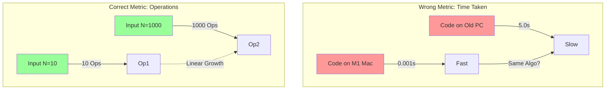
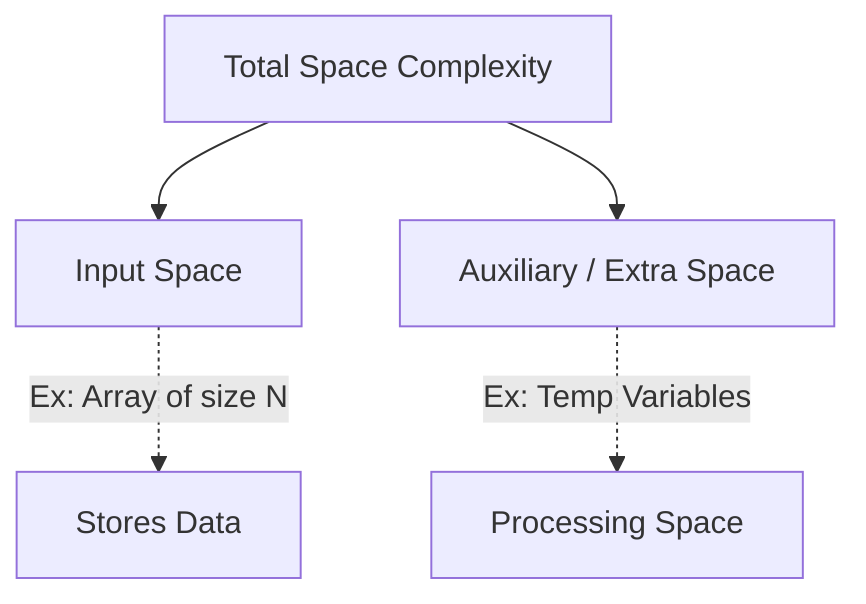

# Complexity Analysis (CS Fundamentals)
*Based on notes from Gaurav Sen*

## 1. Time Complexity
**Definition**: It is a function that gives the relationship about how **time will grow** as **Input grows**.

It describes the *rate of change*, not the absolute seconds.


### Time Complexity != Time Taken
A common misconception is that time complexity measures the exact seconds a code runs. This is incorrect because hardware affects speed.

**Example from Notes**:
Comparing a **Macbook (M1)** vs a **Basic Windows PC**.
- If we run the *same code* on both, the M1 will almost always be faster.
- Does that mean the code has better complexity on M1? **No.**
- We do **not** compare based on "Time Taken" because hardware varies. We compare based on **operations**.



## 2. Space Complexity
**Definition**: The total space required by the algorithm.
It is the sum of **Input Space** (space to store inputs) + **Auxiliary Space** (extra/temporary space used by the algorithm).

> **Formula**: `Space Complexity = Input Space + Auxiliary Space`



## 3. Order of Growth Hierarchy
The notes highlight a specific comparison of common complexities:

> **Order**: `O(1) < O(log N) < O(N)`

1.  **O(1)**: Constant (Best). Time doesn't change with input.
2.  **O(log N)**: Logarithmic. Grows very slowly (e.g., Binary Search).
3.  **O(N)**: Linear. Grows proportionally (e.g., Simple Loop).

```mermaid
xychart-beta
    title "Growth Comparison: O(1) vs O(log N) vs O(N)"
    x-axis "Input Size (N)" [1, 10, 100, 1000]
    y-axis "Operations" 0 --> 1000
    line [1, 1, 1, 1] text "O(1)"
    line [1, 3, 6, 10] text "O(log N)"
    line [1, 10, 100, 1000] text "O(N)"
```
