# Complexity Analysis (CS Fundamentals)
*Based on notes from Gaurav Sen*

---

## 📚 Table of Contents
1. [Time Complexity](#1-time-complexity)
2. [Space Complexity](#2-space-complexity)
3. [Complete Order of Growth Hierarchy](#3-complete-order-of-growth-hierarchy)
4. [Complexity Classes with Code Examples](#4-complexity-classes-with-code-examples)
5. [Growth Rate Comparison](#5-growth-rate-comparison)
6. [Quick Reference Cheat Sheet](#6-quick-reference-cheat-sheet)

---

## 1. Time Complexity
**Definition**: It is a function that gives the relationship about how **time will grow** as **Input grows**.

It describes the *rate of change*, not the absolute seconds.


### Time Complexity != Time Taken
A common misconception is that time complexity measures the exact seconds a code runs. This is incorrect because hardware affects speed.

**Example from Notes**:
Comparing a **Macbook (M1)** vs a **Basic Windows PC**.
- If we run the *same code* on both, the M1 will almost always be faster.
- Does that mean the code has better complexity on M1? **No.**
- We do **not** compare based on "Time Taken" because hardware varies. We compare based on **operations**.


---

## 2. Space Complexity
**Definition**: The total space required by the algorithm.
It is the sum of **Input Space** (space to store inputs) + **Auxiliary Space** (extra/temporary space used by the algorithm).

> **Formula**: `Space Complexity = Input Space + Auxiliary Space`


---

## 3. Complete Order of Growth Hierarchy

> **Full Order**: `O(1) < O(log N) < O(N) < O(N log N) < O(N²) < O(N³) < O(2ⁿ) < O(N!)`

```mermaid
graph LR
    subgraph "🟢 Excellent"
        O1["O(1)<br/>Constant"]
        Olog["O(log N)<br/>Logarithmic"]
    end
    
    subgraph "🟡 Good"
        ON["O(N)<br/>Linear"]
        ONlog["O(N log N)<br/>Linearithmic"]
    end
    
    subgraph "🟠 Fair"
        ON2["O(N²)<br/>Quadratic"]
        ON3["O(N³)<br/>Cubic"]
    end
    
    subgraph "🔴 Poor"
        O2n["O(2ⁿ)<br/>Exponential"]
        ONfact["O(N!)<br/>Factorial"]
    end
    
    O1 --> Olog --> ON --> ONlog --> ON2 --> ON3 --> O2n --> ONfact
```



### What Does Each Mean?

| Complexity | Name | Operations (N=10) | Operations (N=100) | Practical? |
|:----------:|:----:|:-----------------:|:------------------:|:----------:|
| O(1) | Constant | 1 | 1 | ✅ Always |
| O(log N) | Logarithmic | 3 | 7 | ✅ Always |
| O(N) | Linear | 10 | 100 | ✅ Always |
| O(N log N) | Linearithmic | 33 | 664 | ✅ Usually |
| O(N²) | Quadratic | 100 | 10,000 | ⚠️ Sometimes |
| O(N³) | Cubic | 1,000 | 1,000,000 | ⚠️ Rarely |
| O(2ⁿ) | Exponential | 1,024 | 1.27 × 10³⁰ | ❌ Avoid |
| O(N!) | Factorial | 3,628,800 | 9.33 × 10¹⁵⁷ | ❌ Never |

---

## 4. Complexity Classes with Code Examples

### 🟢 O(1) — Constant Time
Time remains the same regardless of input size.

```python
def get_first_element(arr):
    """O(1) - Always one operation"""
    return arr[0]

def check_even_odd(n):
    """O(1) - Single comparison"""
    return "Even" if n % 2 == 0 else "Odd"

# HashMap/Dictionary Access
def get_value(hashmap, key):
    """O(1) - Direct access via hash"""
    return hashmap.get(key)
```


---

### 🟢 O(log N) — Logarithmic Time
Halves the problem space each step. Classic example: **Binary Search**.

```python
def binary_search(arr, target):
    """O(log N) - Halves search space each iteration"""
    left, right = 0, len(arr) - 1
    
    while left <= right:
        mid = (left + right) // 2
        
        if arr[mid] == target:
            return mid
        elif arr[mid] < target:
            left = mid + 1  # Discard left half
        else:
            right = mid - 1  # Discard right half
    
    return -1

# Example: Finding in sorted array of 1024 elements
# Only needs log₂(1024) = 10 comparisons max!
```



```mermaid
flowchart TD
    A["Array: 16 elements"] --> B["Check middle<br/>8 elements left"]
    B --> C["Check middle<br/>4 elements left"]
    C --> D["Check middle<br/>2 elements left"]
    D --> E["Check middle<br/>1 element left"]
    E --> F["✅ Found or Not Found"]
    
    style A fill:#e6ffe6
    style F fill:#99ff99
```

**Why O(log N)?**
- Each step cuts the problem in **half**
- For N elements: needs log₂(N) steps
- 1000 elements → only ~10 steps
- 1,000,000 elements → only ~20 steps

---

### 🟡 O(N) — Linear Time
Operations grow directly with input size.

```python
def find_max(arr):
    """O(N) - Must check every element"""
    max_val = arr[0]
    for num in arr:  # N iterations
        if num > max_val:
            max_val = num
    return max_val

def linear_search(arr, target):
    """O(N) - Worst case: check all elements"""
    for i, val in enumerate(arr):
        if val == target:
            return i
    return -1

def sum_array(arr):
    """O(N) - Touch each element once"""
    total = 0
    for num in arr:
        total += num
    return total
```


---

### 🟡 O(N log N) — Linearithmic Time
Common in efficient sorting algorithms. Combines linear passes with logarithmic divisions.

```python
def merge_sort(arr):
    """O(N log N) - Divide and conquer sorting"""
    if len(arr) <= 1:
        return arr
    
    mid = len(arr) // 2
    left = merge_sort(arr[:mid])   # log N levels of division
    right = merge_sort(arr[mid:])
    
    return merge(left, right)  # N work at each level

def merge(left, right):
    """Merge two sorted arrays - O(N)"""
    result = []
    i = j = 0
    
    while i < len(left) and j < len(right):
        if left[i] <= right[j]:
            result.append(left[i])
            i += 1
        else:
            result.append(right[j])
            j += 1
    
    result.extend(left[i:])
    result.extend(right[j:])
    return result
```


**Why O(N log N)?**
- **log N** levels of recursion (dividing in half)
- **N** work at each level (merging all elements)
- Total: N × log N operations

---

### 🟠 O(N²) — Quadratic Time
Nested loops over the same data. Often seen in brute-force solutions.

```python
def bubble_sort(arr):
    """O(N²) - Nested loops comparing pairs"""
    n = len(arr)
    for i in range(n):           # N iterations
        for j in range(n - 1):   # N iterations
            if arr[j] > arr[j + 1]:
                arr[j], arr[j + 1] = arr[j + 1], arr[j]
    return arr

def find_pairs_brute_force(arr, target_sum):
    """O(N²) - Check all pairs"""
    pairs = []
    n = len(arr)
    for i in range(n):              # N iterations
        for j in range(i + 1, n):   # ~N iterations
            if arr[i] + arr[j] == target_sum:
                pairs.append((arr[i], arr[j]))
    return pairs

def has_duplicate(arr):
    """O(N²) - Compare every element with every other"""
    n = len(arr)
    for i in range(n):
        for j in range(i + 1, n):
            if arr[i] == arr[j]:
                return True
    return False
```


**Visual: Why N² is Expensive**
```
N=10:   10 × 10 = 100 operations ✓
N=100:  100 × 100 = 10,000 operations ⚠️
N=1000: 1000 × 1000 = 1,000,000 operations ❌
```

---

### 🟠 O(N³) — Cubic Time
Triple nested loops. Often in matrix operations.

```python
def matrix_multiply_naive(A, B):
    """O(N³) - Standard matrix multiplication"""
    n = len(A)
    result = [[0] * n for _ in range(n)]
    
    for i in range(n):          # N
        for j in range(n):      # N
            for k in range(n):  # N
                result[i][j] += A[i][k] * B[k][j]
    
    return result

def find_triplets(arr, target_sum):
    """O(N³) - Find all triplets that sum to target"""
    triplets = []
    n = len(arr)
    for i in range(n):
        for j in range(i + 1, n):
            for k in range(j + 1, n):
                if arr[i] + arr[j] + arr[k] == target_sum:
                    triplets.append((arr[i], arr[j], arr[k]))
    return triplets
```

---

### 🔴 O(2ⁿ) — Exponential Time
Doubles with each additional input. Often in recursive solutions without memoization.

```python
def fibonacci_naive(n):
    """O(2ⁿ) - Each call spawns 2 more calls"""
    if n <= 1:
        return n
    return fibonacci_naive(n - 1) + fibonacci_naive(n - 2)

def all_subsets(arr):
    """O(2ⁿ) - Generate all 2^N subsets"""
    if not arr:
        return [[]]
    
    first = arr[0]
    rest_subsets = all_subsets(arr[1:])
    
    # Include first element in each subset
    with_first = [[first] + subset for subset in rest_subsets]
    
    return rest_subsets + with_first

# Example: [1, 2, 3] has 2³ = 8 subsets:
# [], [1], [2], [3], [1,2], [1,3], [2,3], [1,2,3]
```


**Why O(2ⁿ) is Terrible:**
```
N=10:  2¹⁰ = 1,024 calls
N=20:  2²⁰ = 1,048,576 calls
N=30:  2³⁰ = 1,073,741,824 calls 🔥
N=40:  2⁴⁰ = 1,099,511,627,776 calls 💀
```

> 💡 **Fix**: Use **Dynamic Programming** (Memoization) to reduce to O(N)

```python
def fibonacci_dp(n, memo={}):
    """O(N) - With memoization"""
    if n in memo:
        return memo[n]
    if n <= 1:
        return n
    memo[n] = fibonacci_dp(n - 1, memo) + fibonacci_dp(n - 2, memo)
    return memo[n]
```

---

### 🔴 O(N!) — Factorial Time
The worst practical complexity. Used in brute-force permutation problems.

```python
def all_permutations(arr):
    """O(N!) - Generate all N! permutations"""
    if len(arr) <= 1:
        return [arr]
    
    result = []
    for i, item in enumerate(arr):
        rest = arr[:i] + arr[i+1:]
        for perm in all_permutations(rest):
            result.append([item] + perm)
    
    return result

def traveling_salesman_brute(graph):
    """O(N!) - Try all possible routes"""
    from itertools import permutations
    
    cities = list(range(len(graph)))
    min_cost = float('inf')
    
    for perm in permutations(cities):  # N! permutations
        cost = sum(graph[perm[i]][perm[i+1]] 
                   for i in range(len(perm)-1))
        cost += graph[perm[-1]][perm[0]]  # Return to start
        min_cost = min(min_cost, cost)
    
    return min_cost
```

**Why O(N!) is Impractical:**
```
N=5:   5! = 120
N=10:  10! = 3,628,800
N=15:  15! = 1,307,674,368,000
N=20:  20! = 2,432,902,008,176,640,000 💀
```

---

## 5. Growth Rate Comparison

### 📊 Visual Comparison Chart


### 📊 Exponential vs Polynomial (Smaller Scale)


### Real-World Time Estimates

Assuming **1 billion (10⁹) operations per second**:

| Complexity | N = 10 | N = 100 | N = 1,000 | N = 10,000 |
|:----------:|:------:|:------:|:--------:|:---------:|
| O(1) | 1 ns | 1 ns | 1 ns | 1 ns |
| O(log N) | 3 ns | 7 ns | 10 ns | 13 ns |
| O(N) | 10 ns | 100 ns | 1 μs | 10 μs |
| O(N log N) | 33 ns | 664 ns | 10 μs | 133 μs |
| O(N²) | 100 ns | 10 μs | 1 ms | 100 ms |
| O(2ⁿ) | 1 μs | 4×10¹³ years | ∞ | ∞ |

---

## 6. Quick Reference Cheat Sheet

### 🎯 Common Algorithms & Their Complexities

| Algorithm | Time (Best) | Time (Avg) | Time (Worst) | Space |
|:----------|:-----------:|:----------:|:------------:|:-----:|
| **Binary Search** | O(1) | O(log N) | O(log N) | O(1) |
| **Linear Search** | O(1) | O(N) | O(N) | O(1) |
| **Bubble Sort** | O(N) | O(N²) | O(N²) | O(1) |
| **Merge Sort** | O(N log N) | O(N log N) | O(N log N) | O(N) |
| **Quick Sort** | O(N log N) | O(N log N) | O(N²) | O(log N) |
| **Heap Sort** | O(N log N) | O(N log N) | O(N log N) | O(1) |
| **Hash Table Access** | O(1) | O(1) | O(N) | O(N) |
| **BFS/DFS (Graph)** | O(V+E) | O(V+E) | O(V+E) | O(V) |

### 🎯 Data Structure Operations

| Structure | Access | Search | Insert | Delete |
|:----------|:------:|:------:|:------:|:------:|
| **Array** | O(1) | O(N) | O(N) | O(N) |
| **Linked List** | O(N) | O(N) | O(1) | O(1) |
| **Stack** | O(N) | O(N) | O(1) | O(1) |
| **Queue** | O(N) | O(N) | O(1) | O(1) |
| **Hash Table** | N/A | O(1) | O(1) | O(1) |
| **BST (balanced)** | O(log N) | O(log N) | O(log N) | O(log N) |
| **Heap** | O(1)* | O(N) | O(log N) | O(log N) |

*Heap: O(1) for min/max access only

### 🧠 Interview Tips

```mermaid
flowchart TD
    A[See Problem] --> B{Recognize Pattern?}
    B -->|Sorted Array| C["Binary Search → O(log N)"]
    B -->|Need All Pairs| D["Two Pointers → O(N)"]
    B -->|Optimization| E["DP → O(N) or O(N²)"]
    B -->|Graph Traversal| F["BFS/DFS → O(V+E)"]
    B -->|Brute Force Only| G["Consider O(N²) or O(2ⁿ)"]
    
    style C fill:#99ff99
    style D fill:#99ff99
    style E fill:#ffffcc
    style F fill:#ffffcc
    style G fill:#ff9999
```



> 💡 **Rule of Thumb**: If N ≤ 10, even O(N!) might work. If N ≤ 100, O(N²) is fine. If N ≤ 10⁶, aim for O(N log N) or better.

---

## 7. 🧙 Complexity Detection Hacks

> **The Ultimate Cheat Codes**: Look at the problem/code and instantly know the complexity!

### 🔍 Hack #1: Count the Loops

| Pattern | Complexity | Example |
|:--------|:----------:|:--------|
| No loops, just math/access | **O(1)** | `return arr[0] + arr[n-1]` |
| 1 loop through N | **O(N)** | `for i in range(n)` |
| 2 nested loops | **O(N²)** | `for i... for j...` |
| 3 nested loops | **O(N³)** | `for i... for j... for k...` |
| Loop that halves each time | **O(log N)** | `while n > 0: n //= 2` |
| Loop N × loop that halves | **O(N log N)** | Merge sort pattern |

```python
# Quick Visual Recognition:

# O(1) - No loop
def constant(arr):
    return arr[0]

# O(N) - Single loop
def linear(arr):
    for x in arr:    # ← ONE loop = O(N)
        print(x)

# O(N²) - Nested loops
def quadratic(arr):
    for i in arr:        # ← First loop
        for j in arr:    # ← Second loop = O(N²)
            print(i, j)

# O(log N) - Halving loop
def logarithmic(n):
    while n > 1:         # ← Divides each time = O(log N)
        n = n // 2

# O(N log N) - Linear × Logarithmic
def linearithmic(arr):
    for x in arr:            # ← O(N)
        binary_search(arr, x)  # ← O(log N) inside = O(N log N)
```

---

### 🔍 Hack #2: Problem Constraint Tells You the Answer!

> **This is the BIGGEST hack!** Look at the constraints in the problem.

```mermaid
flowchart TD
    A["Look at N constraint"] --> B{What's N?}
    B -->|"N ≤ 10"| C["O(N!) or O(2ⁿ) okay<br/>Brute force works"]
    B -->|"N ≤ 20"| D["O(2ⁿ) okay<br/>Bitmask DP, Recursion"]
    B -->|"N ≤ 500"| E["O(N³) okay<br/>3 nested loops"]
    B -->|"N ≤ 5,000"| F["O(N²) okay<br/>2 nested loops"]
    B -->|"N ≤ 10⁶"| G["O(N log N) needed<br/>Sorting, Heap, Divide & Conquer"]
    B -->|"N ≤ 10⁸"| H["O(N) needed<br/>Single pass, Hash Map"]
    B -->|"N ≤ 10¹⁸"| I["O(log N) or O(1) needed<br/>Math formula, Binary Search"]
    
    style C fill:#ff9999
    style D fill:#ffaaaa
    style E fill:#ffcccc
    style F fill:#ffffcc
    style G fill:#ccffcc
    style H fill:#99ff99
    style I fill:#66ff66
```



**Quick Reference Table:**

| Constraint | Max Complexity | What to Use |
|:-----------|:--------------|:------------|
| N ≤ **10** | O(N!), O(2ⁿ) | Brute force, All permutations |
| N ≤ **20** | O(2ⁿ) | Bitmask DP, Backtracking |
| N ≤ **100** | O(N³) | DP with 3D state |
| N ≤ **500** | O(N³) | Floyd-Warshall, Matrix DP |
| N ≤ **5,000** | O(N²) | Nested loops, 2D DP |
| N ≤ **10⁵** | O(N log N) | Sorting + Binary Search |
| N ≤ **10⁶** | O(N log N) | Merge Sort, Heap |
| N ≤ **10⁷** | O(N) | Single pass, HashMap |
| N ≤ **10⁸** | O(N) | Very optimized O(N) |
| N ≤ **10¹⁸** | O(log N), O(1) | Binary Search, Math |

> ⚡ **Pro Tip**: Online judges allow ~10⁸ operations per second. If N = 10⁵ and you use O(N²), that's 10¹⁰ operations = **TLE (Time Limit Exceeded)!**

---

### 🔍 Hack #3: Keyword → Complexity Mapping

| Problem Keywords | Think About | Complexity |
|:----------------|:------------|:----------:|
| "Find if exists" in sorted | Binary Search | O(log N) |
| "Find all pairs" | Two pointers / Nested loop | O(N) / O(N²) |
| "Shortest path" (unweighted) | BFS | O(V + E) |
| "Shortest path" (weighted) | Dijkstra | O(E log V) |
| "All permutations" | Backtracking | O(N!) |
| "All subsets" | Recursion / Bitmask | O(2ⁿ) |
| "Minimum/Maximum of X" | DP or Greedy | O(N) / O(N²) |
| "Longest subsequence" | DP | O(N²) or O(N log N) |
| "Connected components" | DFS/BFS | O(V + E) |
| "Topological order" | DFS / Kahn's | O(V + E) |
| "Merge intervals" | Sort + Linear | O(N log N) |
| "K-th largest/smallest" | Heap / QuickSelect | O(N log K) / O(N) |
| "Sliding window" | Two pointers | O(N) |
| "Prefix sum" | Precompute + Query | O(N) + O(1) |

---

### 🔍 Hack #4: Recursion Complexity Detection


**Recursion Formula Cheat Sheet:**

| Recurrence | Complexity | Example Algorithm |
|:-----------|:----------:|:-----------------|
| `T(N) = T(N-1) + O(1)` | O(N) | Factorial, Linear recursion |
| `T(N) = T(N/2) + O(1)` | O(log N) | Binary Search |
| `T(N) = T(N/2) + O(N)` | O(N) | Finding median |
| `T(N) = 2T(N/2) + O(1)` | O(N) | Tree traversal |
| `T(N) = 2T(N/2) + O(N)` | O(N log N) | Merge Sort |
| `T(N) = 2T(N-1) + O(1)` | O(2ⁿ) | Naive Fibonacci |
| `T(N) = N × T(N-1)` | O(N!) | Permutations |

---

### 🔍 Hack #5: Data Structure Tells You Complexity

| When You See... | Expect Complexity |
|:---------------|:-----------------:|
| **HashMap/Set** used | O(1) per operation |
| **Sorting** first | O(N log N) + rest |
| **Binary Search** | O(log N) |
| **Heap / Priority Queue** | O(log N) per operation |
| **Two Pointers** | O(N) for the whole thing |
| **Stack/Queue** BFS/DFS | O(V + E) |
| **Union-Find** | O(α(N)) ≈ O(1) |
| **Segment Tree / BIT** | O(log N) per query |
| **Trie** | O(L) where L = string length |

---

### 🔍 Hack #6: The "Divide by 2" Rule

> If something **halves** or **doubles** each step, think **O(log N)**

```python
# All of these are O(log N):

# Pattern 1: Loop that halves
i = n
while i > 0:
    i //= 2  # ← Halves each time ✓

# Pattern 2: Loop that doubles
i = 1
while i < n:
    i *= 2  # ← Doubles each time ✓

# Pattern 3: Binary Search
while left <= right:
    mid = (left + right) // 2  # ← Search space halves ✓
    
# Pattern 4: Exponentiation by squaring
def power(x, n):
    if n == 0: return 1
    if n % 2 == 0:
        return power(x * x, n // 2)  # ← N halves ✓
```

---

### 🔍 Hack #7: Quick Visual Pattern Recognition

```
┌────────────────────────────────────────────────────────────────┐
│                    CODE PATTERN → COMPLEXITY                    │
├────────────────────────────────────────────────────────────────┤
│                                                                │
│   arr[i]                          →  O(1)                      │
│   hashmap[key]                    →  O(1)                      │
│                                                                │
│   for x in arr:                   →  O(N)                      │
│       ...single operation...                                   │
│                                                                │
│   for x in arr:                   →  O(N²)                     │
│       for y in arr:                                            │
│           ...                                                  │
│                                                                │
│   while n > 0:                    →  O(log N)                  │
│       n //= 2                                                  │
│                                                                │
│   sorted(arr)                     →  O(N log N)                │
│   arr.sort()                      →  O(N log N)                │
│                                                                │
│   for x in arr:                   →  O(N log N)                │
│       binary_search(...)                                       │
│                                                                │
│   def f(n):                       →  O(2ⁿ)                     │
│       return f(n-1) + f(n-2)                                   │
│                                                                │
│   itertools.permutations(arr)     →  O(N!)                     │
│                                                                │
└────────────────────────────────────────────────────────────────┘
```

---

### 🎯 Ultimate Decision Flowchart


---

### 📝 Practice: Identify the Complexity!

Try to identify the complexity before revealing the answer:

<details>
<summary><b>1. Find if number exists in sorted array</b></summary>

**Answer: O(log N)** — Binary Search (sorted + exact match)
</details>

<details>
<summary><b>2. Find all pairs that sum to K</b></summary>

**Answer: O(N)** — Use HashMap, or O(N²) with nested loops
</details>

<details>
<summary><b>3. Sort array, then find K-th element</b></summary>

**Answer: O(N log N)** — Sorting dominates
</details>

<details>
<summary><b>4. Generate all subsets of a set</b></summary>

**Answer: O(2ⁿ)** — There are 2ⁿ subsets
</details>

<details>
<summary><b>5. Check if string is palindrome</b></summary>

**Answer: O(N)** — Single pass from both ends
</details>

<details>
<summary><b>6. Find shortest path in unweighted graph</b></summary>

**Answer: O(V + E)** — BFS traversal
</details>

<details>
<summary><b>7. Constraint says N ≤ 20, find minimum cost path</b></summary>

**Answer: O(2ⁿ) or O(N²·2ⁿ)** — Bitmask DP is intended
</details>

<details>
<summary><b>8. Loop: while(n > 0) { n = n / 3; }</b></summary>

**Answer: O(log N)** — Dividing by constant = logarithmic
</details>

---

*Last Updated: January 2026*
