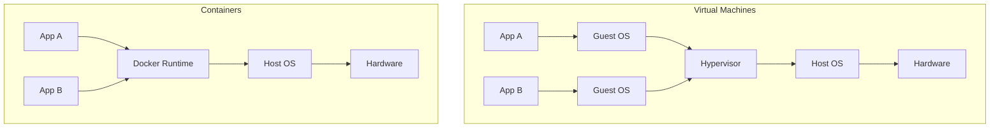
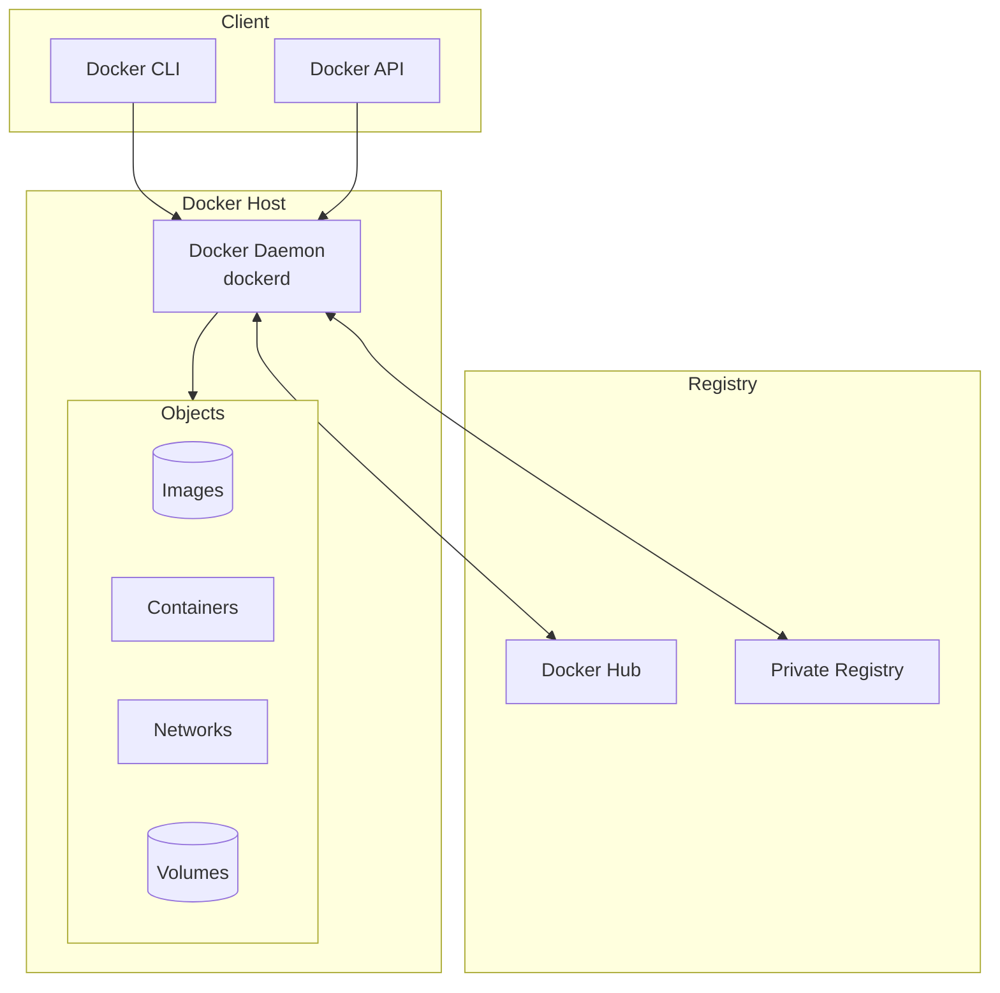
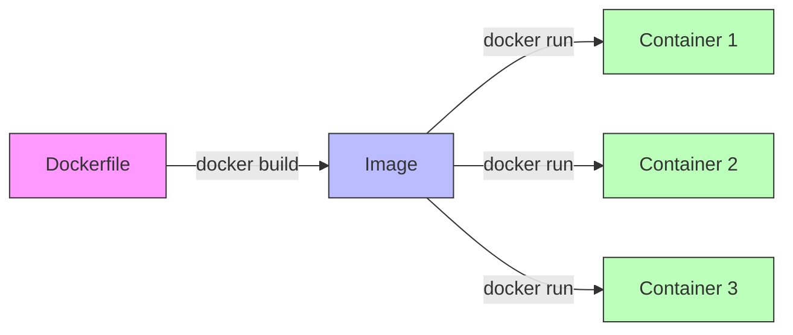
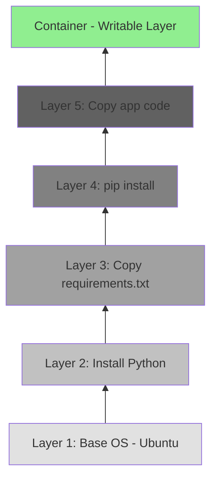
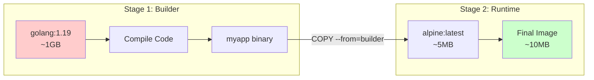
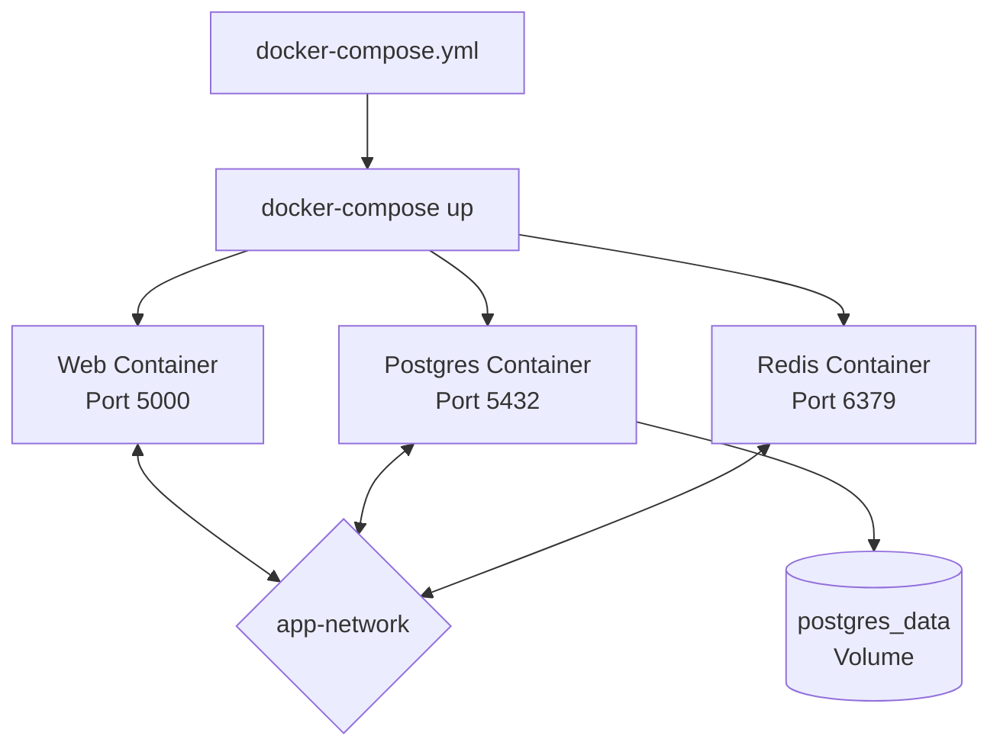
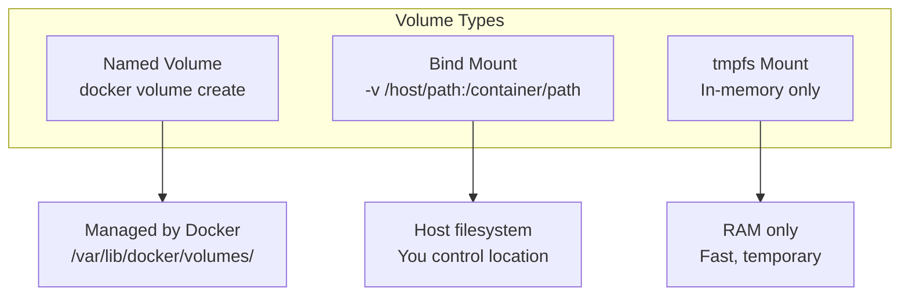
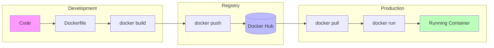

# Docker & DevOps Technical Guide
*Comprehensive Learning & Interview Reference*

> **Audience:** Public learners  
> **Prerequisites:** Command-line basics and basic application deployment concepts  
> **Estimated time:** 4-5 hours  
> **Last reviewed:** 2026-02-08  
> **Tags:** `DevOps`, `Cloud`

> 💡 **Format**: Each topic has a **🎯 One-Liner** (quick interview response) + **📖 Elaboration** (detailed explanation)

---

## 📚 Table of Contents
1. [Docker Fundamentals](#1-docker-fundamentals)
2. [Core Concepts & Architecture](#2-core-concepts--architecture)
3. [Essential Commands Cheat Sheet](#3-essential-commands-cheat-sheet)
4. [Dockerfile Deep Dive](#4-dockerfile-deep-dive)
5. [Docker Compose](#5-docker-compose)
6. [Networking](#6-networking)
7. [Volumes & Data Persistence](#7-volumes--data-persistence)
8. [Security Best Practices](#8-security-best-practices)
9. [Interview Q&A](#9-interview-qa)
10. [Quick Revision Cheat Sheet](#10-quick-revision-cheat-sheet)

---

## 1. Docker Fundamentals

### What is Docker?

**🎯 One-Liner**: "Docker is a containerization platform that packages applications with their dependencies into isolated, portable containers."

**📖 Elaboration**:
- **Problem it solves**: "Works on my machine" → Works everywhere
- **Container**: Lightweight, standalone executable that includes code, runtime, libraries, and settings
- **Key difference from VMs**: Containers share the host OS kernel (no full OS per container)



### VMs vs Containers

| Aspect | Virtual Machines | Containers |
|:-------|:-----------------|:-----------|
| **Size** | GBs (full OS) | MBs (just app + deps) |
| **Startup** | Minutes | Seconds |
| **Isolation** | Complete (hardware-level) | Process-level |
| **Performance** | Overhead from Hypervisor | Near-native |
| **Portability** | Less portable | Highly portable |
| **Use Case** | Different OS, strong isolation | Microservices, DevOps |

---

## 2. Core Concepts & Architecture

### Docker Architecture



### Key Components

| Component | Description |
|:----------|:------------|
| **Docker Daemon** | Background service managing containers (`dockerd`) |
| **Docker Client** | CLI tool to interact with daemon (`docker`) |
| **Docker Registry** | Storage for images (Docker Hub, ECR, GCR) |
| **Dockerfile** | Blueprint/recipe to build an image |
| **Image** | Immutable snapshot/template |
| **Container** | Running instance of an image |
| **Volume** | Persistent data storage |
| **Network** | Communication between containers |

### Image vs Container

**🎯 One-Liner**: "An image is a read-only template (like a class); a container is a running instance (like an object)."



### Image Layers

**🎯 One-Liner**: "Docker images are built in layers; each instruction in Dockerfile creates a new layer, and layers are cached for efficiency."



---

## 3. Essential Commands Cheat Sheet

### Image Commands

```bash
# Pull image from registry
docker pull python:3.9

# List local images
docker images
docker image ls

# Build image from Dockerfile
docker build -t myapp:v1 .
docker build -t myapp:v1 -f Dockerfile.prod .

# Remove image
docker rmi myapp:v1
docker image rm myapp:v1

# Remove all unused images
docker image prune -a

# Tag image
docker tag myapp:v1 username/myapp:v1

# Push to registry
docker push username/myapp:v1

# Inspect image
docker inspect myapp:v1

# View image history (layers)
docker history myapp:v1
```

### Container Commands

```bash
# Run container
docker run nginx                        # Basic run
docker run -d nginx                     # Detached (background)
docker run -p 8080:80 nginx            # Port mapping (host:container)
docker run -it ubuntu bash             # Interactive terminal
docker run --name mycontainer nginx    # Named container
docker run --rm nginx                  # Remove on exit
docker run -e ENV_VAR=value nginx      # Environment variable
docker run -v /host:/container nginx   # Volume mount

# List containers
docker ps                  # Running only
docker ps -a               # All (including stopped)

# Container lifecycle
docker start container_id
docker stop container_id
docker restart container_id
docker kill container_id   # Force stop

# Remove container
docker rm container_id
docker rm -f container_id          # Force remove running
docker container prune             # Remove all stopped

# Logs
docker logs container_id
docker logs -f container_id        # Follow (live)
docker logs --tail 100 container_id

# Execute command in running container
docker exec -it container_id bash
docker exec container_id ls /app

# Container stats
docker stats                        # Real-time resource usage
docker top container_id            # Running processes

# Copy files
docker cp file.txt container_id:/path/
docker cp container_id:/path/file.txt .
```

### System Commands

```bash
# System info
docker info
docker version

# Disk usage
docker system df

# Clean up everything
docker system prune -a --volumes

# View all Docker objects
docker ps -a && docker images && docker volume ls && docker network ls
```

---

## 4. Dockerfile Deep Dive

### Basic Dockerfile Structure

```dockerfile
# Base image
FROM python:3.9-slim

# Metadata
LABEL maintainer="nihal@example.com"
LABEL version="1.0"

# Set working directory
WORKDIR /app

# Copy dependency file first (for layer caching)
COPY requirements.txt .

# Install dependencies
RUN pip install --no-cache-dir -r requirements.txt

# Copy application code
COPY . .

# Environment variables
ENV FLASK_APP=app.py
ENV FLASK_ENV=production

# Expose port (documentation)
EXPOSE 5000

# Default command
CMD ["flask", "run", "--host=0.0.0.0"]
```

### Dockerfile Instructions

| Instruction | Purpose | Example |
|:------------|:--------|:--------|
| `FROM` | Base image | `FROM python:3.9` |
| `WORKDIR` | Set working directory | `WORKDIR /app` |
| `COPY` | Copy files from host | `COPY . .` |
| `ADD` | Copy + extract archives/URLs | `ADD app.tar.gz /app` |
| `RUN` | Execute command (build time) | `RUN pip install flask` |
| `CMD` | Default command (run time) | `CMD ["python", "app.py"]` |
| `ENTRYPOINT` | Fixed command (can't override) | `ENTRYPOINT ["python"]` |
| `ENV` | Set environment variable | `ENV PORT=8080` |
| `ARG` | Build-time variable | `ARG VERSION=1.0` |
| `EXPOSE` | Document port | `EXPOSE 8080` |
| `VOLUME` | Create mount point | `VOLUME /data` |
| `USER` | Set user | `USER appuser` |
| `HEALTHCHECK` | Container health check | See below |

### CMD vs ENTRYPOINT

**🎯 One-Liner**: "CMD provides defaults that can be overridden; ENTRYPOINT is the fixed executable."

```dockerfile
# CMD - can be overridden
FROM ubuntu
CMD ["echo", "Hello"]
# docker run myimage         → "Hello"
# docker run myimage echo Hi → "Hi" (CMD overridden)

# ENTRYPOINT - fixed
FROM ubuntu
ENTRYPOINT ["echo"]
CMD ["Hello"]
# docker run myimage         → "Hello"
# docker run myimage Hi      → "Hi" (passed to entrypoint)
```

### Multi-Stage Builds

**🎯 One-Liner**: "Multi-stage builds use multiple FROM statements to create smaller final images by copying only necessary artifacts."

```dockerfile
# Stage 1: Build
FROM golang:1.19 AS builder
WORKDIR /app
COPY . .
RUN go build -o myapp

# Stage 2: Runtime (smaller image)
FROM alpine:latest
WORKDIR /app
COPY --from=builder /app/myapp .
CMD ["./myapp"]

# Result: Final image is ~10MB instead of ~1GB
```



### Best Practices for Dockerfile

```dockerfile
# ✅ GOOD: Specific version tags
FROM python:3.9.7-slim

# ❌ BAD: Using 'latest'
FROM python:latest

# ✅ GOOD: Combine RUN commands (fewer layers)
RUN apt-get update && \
    apt-get install -y --no-install-recommends gcc && \
    rm -rf /var/lib/apt/lists/*

# ❌ BAD: Multiple RUN commands
RUN apt-get update
RUN apt-get install -y gcc

# ✅ GOOD: Copy requirements first (cache dependencies)
COPY requirements.txt .
RUN pip install -r requirements.txt
COPY . .

# ❌ BAD: Copy everything first (cache invalidated on any change)
COPY . .
RUN pip install -r requirements.txt

# ✅ GOOD: Non-root user
RUN useradd -m appuser
USER appuser

# ✅ GOOD: .dockerignore file
# .dockerignore:
# .git
# __pycache__
# *.pyc
# .env
# node_modules
```

---

## 5. Docker Compose

### What is Docker Compose?

**🎯 One-Liner**: "Docker Compose defines and runs multi-container applications using a YAML file."

### docker-compose.yml Example

```yaml
version: '3.8'

services:
  # Web Application
  web:
    build: .
    ports:
      - "5000:5000"
    environment:
      - DATABASE_URL=postgres://db:5432/myapp
      - REDIS_URL=redis://cache:6379
    depends_on:
      - db
      - cache
    volumes:
      - .:/app
    networks:
      - app-network
    restart: unless-stopped

  # Database
  db:
    image: postgres:14
    environment:
      POSTGRES_USER: user
      POSTGRES_PASSWORD: password
      POSTGRES_DB: myapp
    volumes:
      - postgres_data:/var/lib/postgresql/data
    networks:
      - app-network
    healthcheck:
      test: ["CMD-SHELL", "pg_isready -U user"]
      interval: 10s
      timeout: 5s
      retries: 5

  # Cache
  cache:
    image: redis:alpine
    networks:
      - app-network

volumes:
  postgres_data:

networks:
  app-network:
    driver: bridge
```

### Docker Compose Commands

```bash
# Start services
docker-compose up                  # Foreground
docker-compose up -d               # Detached
docker-compose up --build          # Rebuild images

# Stop services
docker-compose down                # Stop and remove
docker-compose down -v             # Also remove volumes
docker-compose stop                # Just stop (keep containers)

# View status
docker-compose ps
docker-compose logs
docker-compose logs -f web         # Follow specific service

# Execute in service
docker-compose exec web bash

# Scale service
docker-compose up -d --scale web=3

# Build only
docker-compose build
```



---

## 6. Networking

### Network Types

**🎯 One-Liner**: "Docker has bridge (default), host (no isolation), none (no network), and overlay (multi-host) network modes."

| Network | Description | Use Case |
|:--------|:------------|:---------|
| **bridge** | Default. Isolated network on host | Single-host containers |
| **host** | Uses host's network directly | Performance-critical apps |
| **none** | No networking | Security, offline processing |
| **overlay** | Multi-host networking | Docker Swarm, Kubernetes |
| **macvlan** | Assigns MAC address | Legacy apps needing direct LAN |

### Network Commands

```bash
# List networks
docker network ls

# Create network
docker network create mynetwork
docker network create --driver bridge mynetwork

# Connect container to network
docker network connect mynetwork container_id

# Disconnect
docker network disconnect mynetwork container_id

# Inspect
docker network inspect mynetwork

# Remove
docker network rm mynetwork
```

### Container Communication

```mermaid
flowchart LR
    subgraph "bridge network"
        Web[web-app<br/>172.17.0.2] <-->|"db:5432"| DB[database<br/>172.17.0.3]
        Web <-->|"redis:6379"| Redis[redis<br/>172.17.0.4]
    end
    
    Host[Host Machine] -->|"localhost:8080 → 172.17.0.2:5000"| Web
```



```bash
# Containers on same network can communicate by name
docker network create mynet
docker run -d --name db --network mynet postgres
docker run -d --name web --network mynet myapp

# Inside 'web' container:
# Can access postgres at 'db:5432' (not IP needed!)
```

---

## 7. Volumes & Data Persistence

### Why Volumes?

**🎯 One-Liner**: "Volumes persist data outside containers; without them, data is lost when containers are removed."

### Volume Types



### Volume Commands

```bash
# Create volume
docker volume create mydata

# List volumes
docker volume ls

# Inspect volume
docker volume inspect mydata

# Remove volume
docker volume rm mydata

# Remove all unused volumes
docker volume prune

# Use named volume
docker run -v mydata:/app/data myimage

# Use bind mount
docker run -v /host/path:/container/path myimage
docker run -v $(pwd):/app myimage  # Current directory

# Read-only mount
docker run -v mydata:/app/data:ro myimage
```

### Volume Use Cases

| Type | When to Use | Example |
|:-----|:------------|:--------|
| **Named Volume** | Database storage, shared data | `postgres_data:/var/lib/postgresql/data` |
| **Bind Mount** | Development (live code reload) | `./src:/app/src` |
| **tmpfs** | Sensitive data, caching | Secrets, session data |

---

## 8. Security Best Practices

### Security Checklist

```
✅ Use official/verified base images
✅ Pin specific image versions (not :latest)
✅ Run as non-root user
✅ Use multi-stage builds (smaller attack surface)
✅ Scan images for vulnerabilities
✅ Don't store secrets in images
✅ Use read-only filesystem when possible
✅ Limit container resources (CPU, memory)
✅ Use Docker Content Trust for signed images
✅ Keep Docker updated
```

### Secure Dockerfile Example

```dockerfile
# Use specific version
FROM python:3.9.7-slim-bullseye

# Create non-root user
RUN groupadd -r appgroup && useradd -r -g appgroup appuser

WORKDIR /app

# Copy and install dependencies as root
COPY requirements.txt .
RUN pip install --no-cache-dir -r requirements.txt

# Copy app code
COPY --chown=appuser:appgroup . .

# Switch to non-root user
USER appuser

# Read-only filesystem compatible
CMD ["gunicorn", "--bind", "0.0.0.0:8000", "app:app"]
```

### Secrets Management

```bash
# ❌ BAD: Hardcoded in Dockerfile
ENV API_KEY=mysecretkey

# ❌ BAD: Hardcoded in docker-compose
environment:
  - API_KEY=mysecretkey

# ✅ GOOD: Environment variable at runtime
docker run -e API_KEY=$API_KEY myimage

# ✅ GOOD: Docker secrets (Swarm)
echo "mysecretkey" | docker secret create api_key -

# ✅ GOOD: External secret manager
# AWS Secrets Manager, HashiCorp Vault, etc.
```

### Resource Limits

```bash
# Limit memory
docker run -m 512m myimage
docker run --memory="512m" myimage

# Limit CPU
docker run --cpus="1.5" myimage
docker run --cpu-shares=512 myimage

# In docker-compose
services:
  web:
    deploy:
      resources:
        limits:
          cpus: '0.5'
          memory: 512M
        reservations:
          memory: 256M
```

---

## 9. Interview Q&A

---

### Q: What is Docker and why use it?

**🎯 One-Liner**: "Docker is a containerization platform that packages apps with dependencies for consistent deployment across environments."

**📖 Elaboration**:
- Solves "works on my machine" problem
- Enables microservices architecture
- Faster deployment and scaling
- Better resource utilization than VMs
- Enables CI/CD pipelines

---

### Q: Difference between Image and Container?

**🎯 One-Liner**: "An image is a read-only template (blueprint); a container is a running instance of that image."

**📖 Elaboration**:
- **Image**: Built from Dockerfile, immutable, stored in registry, shareable
- **Container**: Created from image, has writable layer, has lifecycle (start/stop/remove)
- Analogy: Image = Class, Container = Object

---

### Q: What is a Dockerfile?

**🎯 One-Liner**: "A Dockerfile is a text file with instructions to build a Docker image layer by layer."

**📖 Key Instructions**: FROM, COPY, RUN, CMD, EXPOSE, ENV, WORKDIR

---

### Q: CMD vs ENTRYPOINT?

**🎯 One-Liner**: "CMD provides default arguments that can be overridden; ENTRYPOINT defines the fixed executable."

**📖 Elaboration**:
- `CMD ["python", "app.py"]` → Can be fully overridden
- `ENTRYPOINT ["python"]` + `CMD ["app.py"]` → Only args overridden
- Use ENTRYPOINT for containers that should always run a specific command

---

### Q: What are Docker Volumes?

**🎯 One-Liner**: "Volumes persist data outside containers, surviving container removal and enabling data sharing."

**📖 Types**:
1. Named volumes (Docker-managed)
2. Bind mounts (host directory)
3. tmpfs (memory-only)

---

### Q: How do containers communicate?

**🎯 One-Liner**: "Containers on the same Docker network can communicate using container names as hostnames."

**📖 Elaboration**:
```bash
docker network create mynet
docker run --name db --network mynet postgres
docker run --name web --network mynet myapp
# web can reach postgres at 'db:5432'
```

---

### Q: What is Docker Compose?

**🎯 One-Liner**: "Docker Compose is a tool to define and run multi-container applications using a YAML configuration file."

**📖 Commands**: `docker-compose up`, `down`, `build`, `logs`, `exec`

---

### Q: What is multi-stage build?

**🎯 One-Liner**: "Multi-stage builds use multiple FROM statements to create smaller final images by copying only required artifacts."

**📖 Benefit**: Build image might be 1GB (compilers, tools), final image only 10MB (just binary)

---

### Q: How do you handle secrets in Docker?

**🎯 One-Liner**: "Never hardcode secrets; use environment variables at runtime, Docker Secrets (Swarm), or external secret managers like Vault."

**📖 Methods**:
1. Environment variables: `docker run -e SECRET=$SECRET`
2. Docker Secrets (Swarm): `docker secret create`
3. External: AWS Secrets Manager, HashiCorp Vault

---

### Q: What is the difference between COPY and ADD?

**🎯 One-Liner**: "COPY simply copies files; ADD can also extract archives and fetch URLs (but COPY is preferred for clarity)."

**📖 Recommendation**: Use COPY unless you specifically need ADD's extra features.

---

### Q: How do you optimize Docker images?

**🎯 One-Liner**: "Use slim base images, multi-stage builds, minimize layers, leverage build cache, and use .dockerignore."

**📖 Checklist**:
1. Use `alpine` or `slim` base images
2. Multi-stage builds
3. Combine RUN commands
4. Copy requirements.txt before code
5. Clean up in same RUN command
6. Use .dockerignore

---

### Q: Explain Docker networking modes.

**🎯 One-Liner**: "Bridge (default, isolated), Host (no isolation, uses host network), None (no network), Overlay (multi-host for Swarm)."

| Mode | Isolation | Use Case |
|:-----|:----------|:---------|
| bridge | Yes | Default, container communication |
| host | No | Performance, direct host access |
| none | Complete | Secure, offline |
| overlay | Across hosts | Swarm/K8s clusters |

---

### Q: What is Docker Swarm vs Kubernetes?

**🎯 One-Liner**: "Both are container orchestration tools; Swarm is simpler and built-in, Kubernetes is more powerful and industry-standard."

| Aspect | Docker Swarm | Kubernetes |
|:-------|:-------------|:-----------|
| Complexity | Simple | Complex |
| Scaling | Good | Excellent |
| Ecosystem | Limited | Huge |
| Setup | Easy | Harder |
| Production | Small-medium | Enterprise |

---

## 10. Quick Revision Cheat Sheet

```
┌─────────────────────────────────────────────────────────────────┐
│                     DOCKER QUICK REFERENCE                       │
├─────────────────────────────────────────────────────────────────┤
│ ARCHITECTURE                                                     │
│ Dockerfile → Image → Container                                  │
│ Recipe     → Snapshot → Running Process                         │
├─────────────────────────────────────────────────────────────────┤
│ ESSENTIAL COMMANDS                                               │
│ docker build -t name .     Build image                          │
│ docker run -d -p 80:80     Run detached with port               │
│ docker ps -a               List all containers                  │
│ docker logs -f ID          Follow logs                          │
│ docker exec -it ID bash    Shell into container                 │
│ docker-compose up -d       Start multi-container app            │
├─────────────────────────────────────────────────────────────────┤
│ DOCKERFILE BEST PRACTICES                                        │
│ ✓ Specific version tags (not :latest)                           │
│ ✓ Non-root user                                                  │
│ ✓ Multi-stage builds                                             │
│ ✓ COPY requirements.txt first (cache)                           │
│ ✓ Combine RUN commands                                           │
│ ✓ Use .dockerignore                                              │
├─────────────────────────────────────────────────────────────────┤
│ DATA PERSISTENCE                                                 │
│ Named Volume  → docker volume create                            │
│ Bind Mount    → -v /host:/container                             │
│ tmpfs         → Memory only                                      │
├─────────────────────────────────────────────────────────────────┤
│ NETWORKING                                                       │
│ bridge (default) │ host │ none │ overlay (swarm)                │
│ Containers on same network → use names as hostnames             │
├─────────────────────────────────────────────────────────────────┤
│ SECURITY                                                         │
│ ✗ Never hardcode secrets in Dockerfile                          │
│ ✓ Use env vars at runtime: docker run -e KEY=$KEY               │
│ ✓ Run as non-root: USER appuser                                 │
│ ✓ Limit resources: --memory="512m" --cpus="1"                   │
└─────────────────────────────────────────────────────────────────┘
```

### Visual Summary



---

*Last Updated: February 8, 2026*

---

**Next doc:** [`aws.md`](aws.md)
