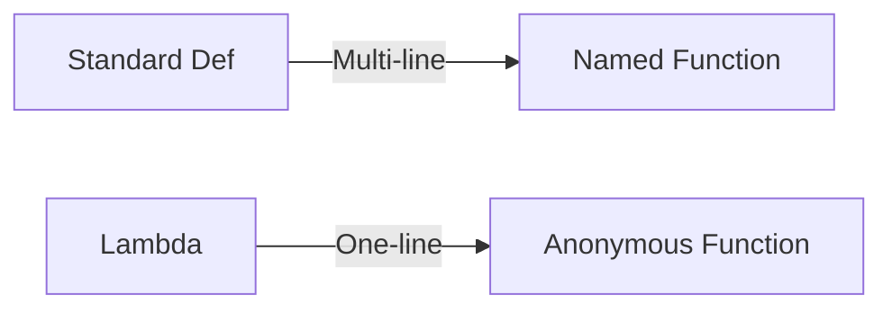
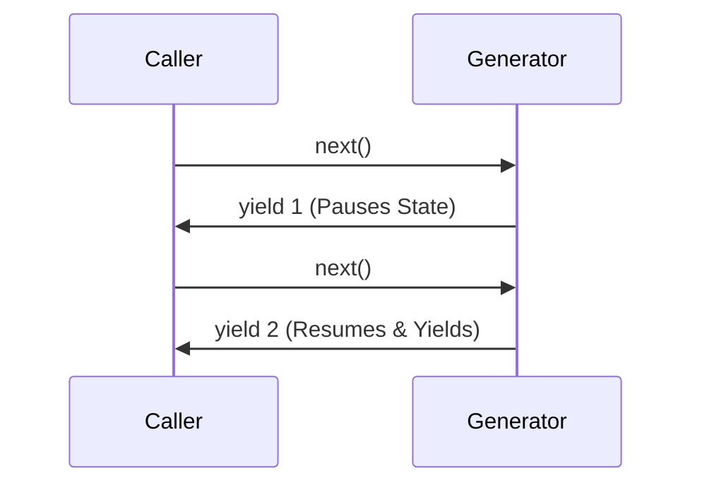
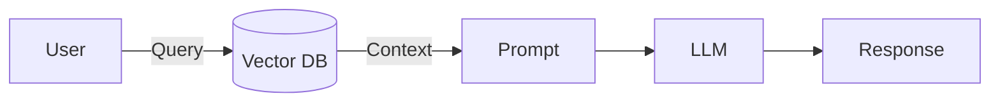
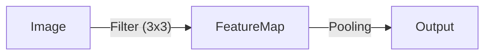
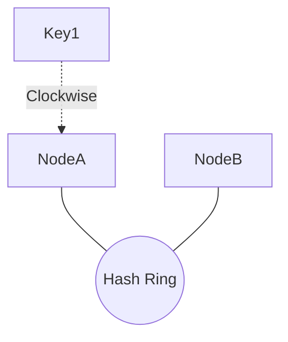

# Visualized Technical Interview Q&A
*Comprehensive Answer Key for 65+ Questions*

---

## 1. Python Core & Advanced Coding

### Q: Tuple vs List?
*   **List**: Mutable (Can add/remove). Slower. `[1, 2]`
*   **Tuple**: Immutable (Fixed). Faster. `(1, 2)`

### Q: *args vs **kwargs
*   `*args`: Variable positional args (Tuple). `def f(*args)` -> `f(1, 2)`
*   `**kwargs`: Variable keyword args (Dict). `def f(**kwargs)` -> `f(a=1, b=2)`

### Q: Lambda Function
Anonymous, single-line function.
```python
square = lambda x: x * x
```
**Visual**:


### Q: Generators vs Normal Functions
Generators use `yield`. They return an iterator that produces items one by one (Lazy Evaluation), saving memory.

**Visual**:


### Q: Memory Management (Stack vs Heap)
*   **Stack**: Stores references & function calls. Fast, LIFO.
*   **Heap**: Stores actual objects (large data). Slower, managed by Garbage Collector.

### Q: Shallow Copy vs Deep Copy
*   **Shallow**: `copy.copy()`. New container, but references same child objects.
*   **Deep**: `copy.deepcopy()`. Recursively creates new objects.

### Q: Multithreading vs Multiprocessing
*   **Threading**: Shared memory. blocked by GIL. **Use case**: I/O Bound (API calls).
*   **Multiprocessing**: Separate memory (new PID). Bypasses GIL. **Use case**: CPU Bound (ML training).

### Q: Decorators
Wrappers that modify function behavior without changing code.
```python
@timer
def my_func(): ...
```

### Q: Optimization Techniques
**Example**: Using `set` for O(1) lookups instead of `list` O(N). Using `generators` for large file processing.

### Q: Unit Test Debugging (No Error Message)
**Approach**:
1.  Isolate the failing test.
2.  Add print/logging statements manually.
3.  Check strictly mocked return values.
4.  Run in verbose mode (`pytest -vv`).

### 💻 Code: List Comprehension (Squares of Odds)
```python
nums = [1, 2, 3, 4]
res = [x**2 for x in nums if x % 2 == 0] # Even squares
```

### 💻 Code: Reverse String 'Nihal' (No Inbuilt)
```python
s = "Nihal"
rev = ""
for char in s:
    rev = char + rev
print(rev) # lahiN
```

### 💻 Code: Word Count Dictionary
```python
text = "hello world hello"
freq = {}
for word in text.split():
    freq[word] = freq.get(word, 0) + 1
# {'hello': 2, 'world': 1}
```

### 💻 Code: Pandas Dataframe
```python
import pandas as pd
data = {"Name": ["Nihal"], "Role": ["Engineer"]}
df = pd.DataFrame(data)
```

---

## 2. AI, GenAI & LLMs (Deep Dive)

### Q: RAG Architecture
**R**etrieval **A**ugmented **G**eneration.
Steps:
1.  **Ingest**: PDF/Text -> Chunks -> Embeddings -> Vector DB.
2.  **Retrieve**: User Query -> Embedding -> Similarity Search -> Top K Chunks.
3.  **Generate**: System Prompt + Context (Chunks) + Query -> LLM.

**Visual**:


### Q: Fine-Tuning vs RAG
*   **RAG**: For "New Information" (News, Private Company Data).
*   **Fine-Tuning**: For "New Behavior/Style" (Medical term understanding, JSON formatting).

### Q: Handling Hallucinations
1.  **Grounding**: "Answer ONLY from the Context."
2.  **Temperature**: Set `temperature=0`.
3.  **CoT**: "Think step-by-step."

### Q: Embeddings & Dimensions
*   **Embedding**: Vector representation of semantic meaning.
*   **"4 Dimensions"**: A vector with 4 numbers. `[0.1, 0.2, 0.9, -0.5]`.
*   **Pinecone Dimension**: Depends on model (e.g., OpenAI `text-embedding-3-small` is `1536`).

### Q: Multi-Agent Systems
Systems where multiple specialized LLM "Agents" collaborate.
*   *Example*: one agent searches web, one writes code, one ensures safety.
*   *Frameworks*: LangGraph, CrewAI.

### Q: LangChain vs LlamaIndex
*   **LangChain**: General purpose "glue" code. Good for flows.
*   **LlamaIndex**: Specialized for **Data**. Best for RAG and indexing strategy.

### Q: Vector DBs (Pinecone vs FAISS/Chroma)
*   **Pinecone**: Managed (Serverless). Easy to scale. Closed source.
*   **FAISS/Chroma**: Open Source. You manage hosting.
*   **Why Pinecone?**: Speed and low maintenance overhead.

### Q: Chunking Strategies
*   **Size-based**: Fixed chars (e.g., 500 chars). Fast but breaks ideas.
*   **Semantic**: Break by paragraphs/topics. Better quality.
*   **Overlap**: Keep 10-20% overlap so context isn't lost at edges.

### Q: Attention & Positional Encoding
*   **Attention**: Mechanism to weigh importance of words relative to each other.
*   **Positional Encoding**: Vectors added to embeddings to tell the Transformer the **order** of words (since it processes parallelly).

### Q: CNN (Convolutional Neural Network)
Uses **Filters** (Kernels) to slide over images and extract features (edges, shapes).
**Visual**:


### 💻 Code: Image to Vector DB
```python
# Pseudo-code
from img_model import CLIP
embedding = CLIP.encode("image.jpg")
vector_db.upsert(id="img1", vector=embedding)
```

### Q: Prompt Engineering
*   **Chain of Thought (CoT)**: "Let's think step by step."
*   **Prompt Injection**: Malicious input to hijack the model (e.g., "Ignore previous instructions").
*   **Ideal System Prompt**: Specific Role + Format Constraints + Tone + Guardrails.

---

## 3. System Design, Databases & Tools

### Q: Consistency Hashing
Distributed hashing to minimize reshuffling when nodes join/leave. Uses a **Ring**.
**Visual**:


### Q: Docker
*   **Dockerfile**: Recipe.
*   **Image**: Snapshot.
*   **Container**: Running Process.
*   **Secrets**: Use Environment Variables or Docker Swarm Secrets. Don't hardcode!

### Q: API: Path vs Query Params
*   **Path**: `/item/{id}` (Identify resource).
*   **Query**: `/item?color=red` (Filter/Sort).

### Q: Stateless vs Stateful
*   **Stateless**: HTTP. Every request is independent.
*   **Stateful**: WebSocket/FTP. Server keeps "Session" open.

### Q: Sorting (Quick vs Bubble)
*   **Quick Sort**: O(N log N). Standard.
*   **Bubble Sort**: O(N^2). Slow/Naive.

### Q: SOLID Principles
1.  **S**ingle Responsibility
2.  **O**pen/Closed
3.  **L**iskov Substitution
4.  **I**nterface Segregation
5.  **D**ependency Inversion

### Q: Git: Status vs Rebase
*   `git status`: Shows modified files.
*   `git rebase`: Rewrites commit history to be linear (moves branch base).

### Q: High Level (HLD) vs Low Level (LLD) Design
*   **HLD**: Architecture, Databases, Microservices interactions.
*   **LLD**: Class diagrams, Function signatures, DB Schema.

---

## 4. Personal & Behavioral (Templates)

| Question | Template / Tip |
| :--- | :--- |
| **Salary Expectations** | "Based on market research for this role, I am looking for X-Y range." |
| **Why Change?** | "Creating impact. I want to work on [Company's problem space]..." |
| **Prioritize Offers** | 1. Tech Stack & Learning 2. Culture 3. Comp. |
| **Weakness** | "I sometimes iterate too long on perfection. Now I use time-boxing." |
| **Achievement** | Use **STAR** Method: **S**ituation, **T**ask, **A**ction, **R**esult. |
| **Backend to QA?** | *Trick Question?* "I am applying for GenAI dev, but I value QA mindset for eval." |
