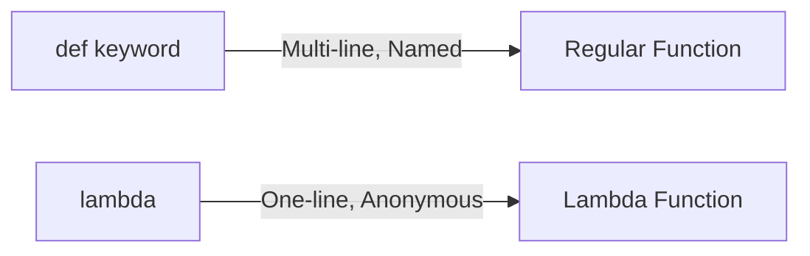
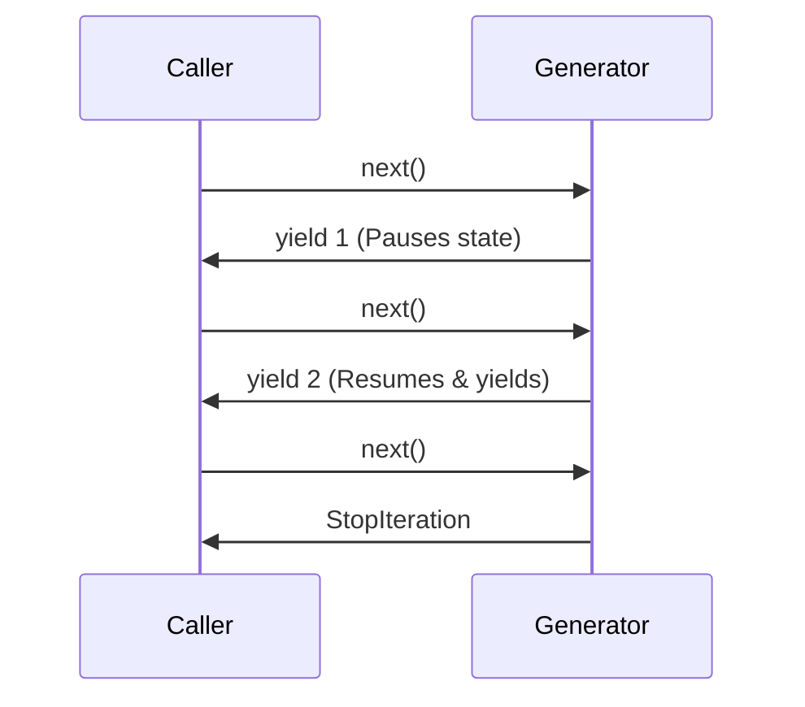
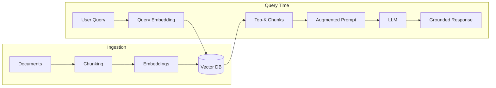
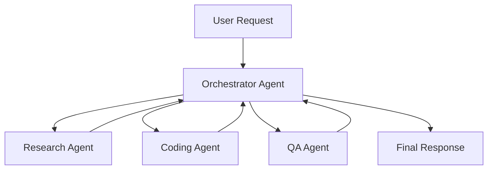
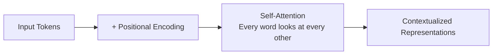
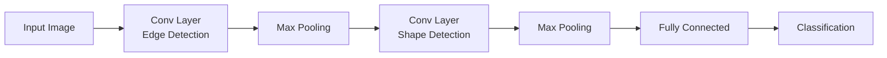
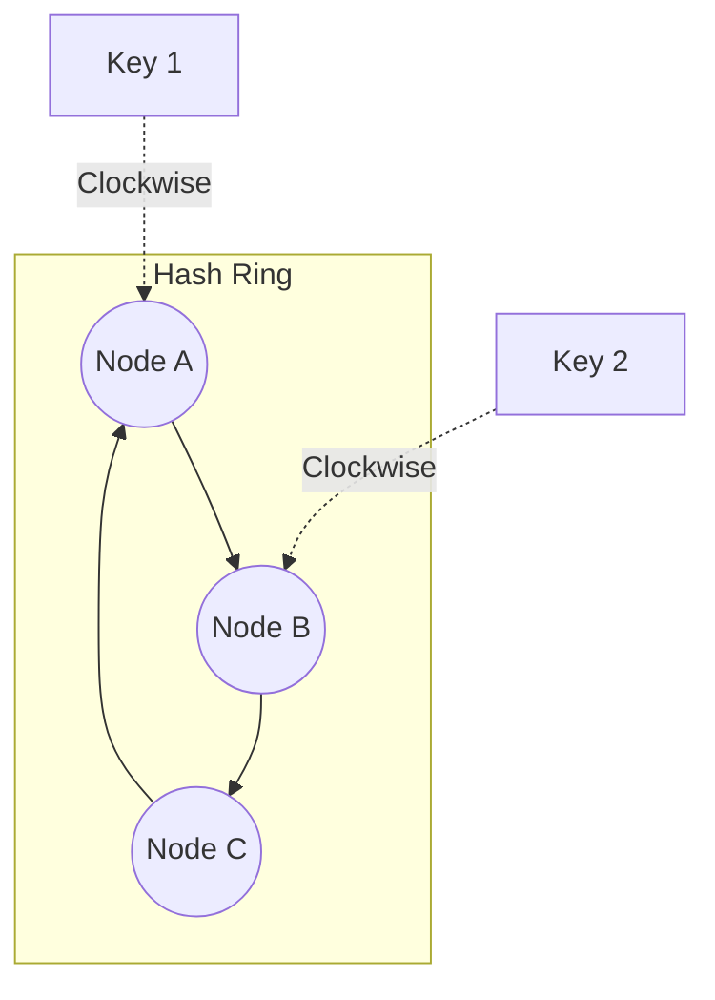

# Visualized Technical Interview Q&A
*Comprehensive Answer Key with Interview-Ready Responses*

> 💡 **Format**: Each answer has a **🎯 One-Liner** (quick response) + **📖 Elaboration** (when they ask "Can you explain more?")

---

## 1. Python Core & Advanced Coding

---

### Q: Tuple vs List?

**🎯 One-Liner**: "Lists are mutable and slower; Tuples are immutable and faster."

**📖 Elaboration**:
- **List** `[1, 2, 3]`: Mutable — you can add, remove, or modify elements. Uses more memory due to dynamic resizing. Best for collections that change.
- **Tuple** `(1, 2, 3)`: Immutable — once created, cannot be changed. Faster access and less memory. Best for fixed data like coordinates, or as dictionary keys.

```python
my_list = [1, 2, 3]
my_list[0] = 10  # ✓ Works

my_tuple = (1, 2, 3)
my_tuple[0] = 10  # ✗ Error: Immutable
```

---

### Q: *args vs **kwargs

**🎯 One-Liner**: "`*args` passes variable positional arguments as a tuple; `**kwargs` passes variable keyword arguments as a dictionary."

**📖 Elaboration**:
- `*args`: Collects extra positional arguments. Useful when you don't know how many args will be passed.
- `**kwargs`: Collects extra keyword arguments. Useful for optional configuration.

```python
def example(*args, **kwargs):
    print(args)    # (1, 2, 3)
    print(kwargs)  # {'name': 'Nihal', 'age': 25}

example(1, 2, 3, name="Nihal", age=25)
```

---

### Q: Lambda Function

**🎯 One-Liner**: "A lambda is an anonymous, single-expression function defined inline."

**📖 Elaboration**:
- Written as `lambda args: expression`
- No `def` keyword, no function name
- Returns result automatically
- Best for short, throwaway functions (e.g., in `map`, `filter`, `sorted`)

```python
# Regular function
def square(x):
    return x * x

# Lambda equivalent
square = lambda x: x * x

# Common use case
sorted(items, key=lambda x: x['price'])
```



---

### Q: Generators vs Normal Functions

**🎯 One-Liner**: "Generators use `yield` to return values lazily one at a time, saving memory."

**📖 Elaboration**:
- Normal functions compute all results at once and return a single value/list.
- Generators `yield` values one by one, pausing execution between yields.
- **Memory efficient**: Only one item in memory at a time.
- **Use case**: Reading large files, infinite sequences, streaming data.

```python
# Normal function - stores ALL in memory
def get_all(n):
    return [x**2 for x in range(n)]  # Million items = Out of Memory!

# Generator - yields ONE at a time
def get_lazily(n):
    for x in range(n):
        yield x**2  # Produces item only when asked
```



---

### Q: Memory Management (Stack vs Heap)

**🎯 One-Liner**: "Stack stores function calls and references (fast, LIFO); Heap stores actual objects managed by garbage collector."

**📖 Elaboration**:
- **Stack**: Fixed size, stores local variables and function call frames. Very fast. Automatically cleaned when function returns.
- **Heap**: Dynamic size, stores objects (lists, dicts, classes). Slower access. Python's garbage collector (reference counting + cycle detector) cleans it.

```mermaid
graph TD
    subgraph Stack
        F1[main()] --> F2[func_a()] --> F3[func_b()]
    end
    subgraph Heap
        Obj1[List Object]
        Obj2[Dict Object]
    end
    F3 -.->|reference| Obj1
```

---

### Q: Shallow Copy vs Deep Copy

**🎯 One-Liner**: "Shallow copy creates a new container but references same nested objects; Deep copy recursively copies everything."

**📖 Elaboration**:
- **Shallow Copy** `copy.copy()`: New outer object, but inner objects are still shared references. Changes to nested objects affect both.
- **Deep Copy** `copy.deepcopy()`: Completely independent copy of all objects at all levels.

```python
import copy

original = [[1, 2], [3, 4]]

shallow = copy.copy(original)
shallow[0][0] = 999
print(original)  # [[999, 2], [3, 4]] - AFFECTED!

deep = copy.deepcopy(original)
deep[0][0] = 111
print(original)  # [[999, 2], [3, 4]] - NOT affected
```

---

### Q: Multithreading vs Multiprocessing

**🎯 One-Liner**: "Threading shares memory but is blocked by GIL (use for I/O); Multiprocessing uses separate processes and bypasses GIL (use for CPU-bound)."

**📖 Elaboration**:
| Aspect | Threading | Multiprocessing |
|:-------|:----------|:----------------|
| Memory | Shared | Separate (isolated) |
| GIL | Blocked | Bypassed |
| Best for | I/O bound (API calls, file I/O) | CPU bound (ML training, math) |
| Overhead | Low | High (process creation) |

```python
# I/O Bound - Use Threading
from concurrent.futures import ThreadPoolExecutor
with ThreadPoolExecutor() as executor:
    executor.map(fetch_url, urls)

# CPU Bound - Use Multiprocessing
from multiprocessing import Pool
with Pool(4) as p:
    p.map(heavy_computation, data)
```

---

### Q: Decorators

**🎯 One-Liner**: "Decorators are functions that wrap other functions to extend their behavior without modifying the original code."

**📖 Elaboration**:
- Defined with `@decorator_name` syntax above a function
- Common uses: logging, timing, authentication, caching
- A decorator takes a function, adds functionality, and returns a new function

```python
def timer(func):
    def wrapper(*args, **kwargs):
        start = time.time()
        result = func(*args, **kwargs)
        print(f"Took {time.time() - start:.2f}s")
        return result
    return wrapper

@timer
def train_model():
    # training code...
    pass

train_model()  # Prints: "Took 5.23s"
```

---

### Q: Optimization Techniques

**🎯 One-Liner**: "Use appropriate data structures (set for O(1) lookup), generators for memory efficiency, and built-in functions which are C-optimized."

**📖 Elaboration**:
| Technique | Before | After |
|:----------|:-------|:------|
| Lookup | `if x in list` O(N) | `if x in set` O(1) |
| Large data | `[x for x in big_file]` | `(x for x in big_file)` generator |
| String concat | `s += char` in loop | `''.join(chars)` |
| Loops | Python for-loop | `map()`, list comprehension |

---

### Q: Unit Test Debugging (No Error Message)

**🎯 One-Liner**: "Isolate the test, add verbose logging, check mock return values, and run with `pytest -vv --tb=long`."

**📖 Elaboration**:
1. **Isolate**: Run only the failing test to reduce noise
2. **Verbose mode**: `pytest -vv --tb=long` for detailed traceback
3. **Add prints/logging**: Temporarily add output to see execution flow
4. **Check mocks**: Verify mock return values match expectations
5. **Use debugger**: `pytest --pdb` drops into debugger on failure

---

### 💻 Code: List Comprehension (Filter & Transform)

**🎯 One-Liner**: "List comprehension is a concise way to create lists with optional filtering."

```python
nums = [1, 2, 3, 4, 5]

# Squares of even numbers
result = [x**2 for x in nums if x % 2 == 0]
# Result: [4, 16]

# Syntax: [expression for item in iterable if condition]
```

---

### 💻 Code: Reverse String (No Built-in)

```python
def reverse_string(s):
    reversed_str = ""
    for char in s:
        reversed_str = char + reversed_str
    return reversed_str

print(reverse_string("Nihal"))  # "lahiN"

# Alternative: Two-pointer approach
def reverse_v2(s):
    chars = list(s)
    left, right = 0, len(chars) - 1
    while left < right:
        chars[left], chars[right] = chars[right], chars[left]
        left += 1
        right -= 1
    return ''.join(chars)
```

---

### 💻 Code: Word Count Dictionary

```python
text = "hello world hello python world"

# Method 1: Manual
freq = {}
for word in text.split():
    freq[word] = freq.get(word, 0) + 1
# {'hello': 2, 'world': 2, 'python': 1}

# Method 2: Counter (preferred)
from collections import Counter
freq = Counter(text.split())
```

---

### 💻 Code: Pandas DataFrame

```python
import pandas as pd

# Create DataFrame
data = {"Name": ["Nihal", "Raj"], "Role": ["Engineer", "Manager"]}
df = pd.DataFrame(data)

# Common operations
df.head()           # First 5 rows
df.describe()       # Statistics
df['Name']          # Select column
df[df['Role'] == 'Engineer']  # Filter rows
```

---

## 2. AI, GenAI & LLMs (Deep Dive)

---

### Q: RAG Architecture

**🎯 One-Liner**: "RAG retrieves relevant context from a vector database and augments the LLM prompt with it before generation."

**📖 Elaboration**:
**R**etrieval **A**ugmented **G**eneration solves LLM limitations (outdated knowledge, hallucinations) by providing real-time context.

**Pipeline**:
1. **Ingest**: Documents → Chunks → Embeddings → Vector DB
2. **Retrieve**: User Query → Embedding → Similarity Search → Top-K Chunks
3. **Generate**: System Prompt + Retrieved Context + Query → LLM → Response



---

### Q: Fine-Tuning vs RAG

**🎯 One-Liner**: "RAG adds new knowledge; Fine-tuning teaches new behavior or style."

**📖 Elaboration**:
| Aspect | RAG | Fine-Tuning |
|:-------|:----|:------------|
| **Purpose** | Add new information | Change behavior/style |
| **Examples** | Company docs, live news | Medical terminology, JSON output |
| **Data needed** | Any documents | Labeled training data |
| **Cost** | Low (just retrieval) | High (GPU training) |
| **Updates** | Real-time (re-index) | Requires retraining |

**Decision**: If you need the model to *know* new facts → RAG. If you need it to *behave* differently → Fine-tune.

---

### Q: Handling Hallucinations

**🎯 One-Liner**: "Use grounding prompts ('Answer ONLY from context'), lower temperature, and chain-of-thought reasoning."

**📖 Elaboration**:
1. **Grounding**: "Only answer based on the provided context. If unsure, say 'I don't know'."
2. **Temperature**: Set `temperature=0` for deterministic, factual responses
3. **Chain of Thought**: "Think step-by-step before answering."
4. **Source Attribution**: "Cite the exact chunk that supports your answer."
5. **Verification Layer**: Add a second LLM call to verify against sources

---

### Q: Embeddings & Dimensions

**🎯 One-Liner**: "An embedding is a dense vector representation of semantic meaning; dimensions are the vector's length (e.g., 1536 for OpenAI)."

**📖 Elaboration**:
- **Embedding**: Converts text/images to numerical vectors where similar meanings are close together in vector space.
- **Dimensions**: The size of the vector. More dimensions = more nuance but more compute.
  - OpenAI `text-embedding-3-small`: 1536 dimensions
  - OpenAI `text-embedding-3-large`: 3072 dimensions
  - Sentence-Transformers: 384-768 dimensions

```python
# Example embedding
text = "Machine learning is awesome"
vector = [0.021, -0.034, 0.891, ...]  # 1536 numbers

# Similar texts have high cosine similarity
cosine_similarity(embed("dog"), embed("puppy"))  # ~0.92
cosine_similarity(embed("dog"), embed("car"))    # ~0.15
```

---

### Q: Multi-Agent Systems

**🎯 One-Liner**: "Multiple specialized LLM agents collaborate, each handling a specific task like research, coding, or verification."

**📖 Elaboration**:
- Instead of one LLM doing everything, specialized agents divide the work
- **Benefits**: Better accuracy, modularity, parallelization
- **Frameworks**: LangGraph, CrewAI, AutoGen



---

### Q: LangChain vs LlamaIndex

**🎯 One-Liner**: "LangChain is general-purpose for building LLM workflows; LlamaIndex specializes in data indexing and RAG."

**📖 Elaboration**:
| Aspect | LangChain | LlamaIndex |
|:-------|:----------|:-----------|
| **Focus** | Building LLM apps (chains, agents) | Data ingestion & retrieval |
| **Strength** | Flexibility, tool integration | Advanced RAG strategies |
| **Best for** | Complex workflows, multi-step agents | Document Q&A, knowledge bases |
| **Learning curve** | Steeper | Easier for RAG |

**Rule of thumb**: For pure RAG → LlamaIndex. For agents + complex flows → LangChain.

---

### Q: Vector DBs (Pinecone vs FAISS/Chroma)

**🎯 One-Liner**: "Pinecone is managed/serverless (easy scaling); FAISS/Chroma are open-source (you host)."

**📖 Elaboration**:
| Database | Type | Best For |
|:---------|:-----|:---------|
| **Pinecone** | Managed SaaS | Production, auto-scaling, low maintenance |
| **FAISS** | Open Source (Meta) | High-performance local search, research |
| **Chroma** | Open Source | Quick prototyping, local development |
| **Weaviate** | Open Source | Hybrid search (vector + keyword) |

**Why Pinecone?**: Zero DevOps, automatic scaling, millisecond latency.

---

### Q: Chunking Strategies

**🎯 One-Liner**: "Size-based chunking splits by character count; Semantic chunking splits by meaning; Always add overlap."

**📖 Elaboration**:
| Strategy | Description | Trade-off |
|:---------|:------------|:----------|
| **Fixed-size** | 500-1000 chars each | Fast but breaks mid-sentence |
| **Semantic** | Split by paragraphs/sections | Better quality, harder to implement |
| **Sentence** | Split by sentences | Good balance |
| **Overlap** | 10-20% overlap between chunks | Preserves context at boundaries |

```python
# Example: 500 chars with 50 char overlap
chunk_1 = text[0:500]
chunk_2 = text[450:950]  # Overlaps 50 chars
chunk_3 = text[900:1400]
```

---

### Q: Attention & Positional Encoding

**🎯 One-Liner**: "Attention weighs the importance of each word relative to others; Positional encoding adds word order information since transformers process in parallel."

**📖 Elaboration**:
- **Self-Attention**: Allows each word to "attend" to every other word. "The bank by the **river**" vs "Deposit in the **bank**" — attention helps disambiguate.
- **Positional Encoding**: Since transformers process all words simultaneously (no sequential order), we add position information via sine/cosine functions.



---

### Q: CNN (Convolutional Neural Network)

**🎯 One-Liner**: "CNNs use filters/kernels that slide over images to detect features like edges, shapes, and patterns."

**📖 Elaboration**:
- **Convolution Layer**: Filters slide over image, producing feature maps
- **Pooling Layer**: Reduces dimensionality (Max/Avg pooling)
- **Fully Connected**: Final classification



---

### 💻 Code: Image to Vector DB

```python
# Using CLIP for image embeddings
from sentence_transformers import SentenceTransformer
import pinecone

# Load CLIP model
model = SentenceTransformer('clip-ViT-B-32')

# Generate embedding
image_embedding = model.encode("path/to/image.jpg")

# Store in Pinecone
index.upsert(vectors=[{
    "id": "img_001",
    "values": image_embedding.tolist(),
    "metadata": {"filename": "image.jpg"}
}])
```

---

### Q: Prompt Engineering

**🎯 One-Liner**: "Prompt engineering is crafting inputs to get optimal LLM outputs through techniques like CoT, few-shot examples, and role-playing."

**📖 Elaboration**:
| Technique | Description | Example |
|:----------|:------------|:--------|
| **Chain of Thought** | "Think step-by-step" | Improves reasoning |
| **Few-shot** | Provide examples | 3-5 input-output pairs |
| **Role-playing** | "You are an expert..." | Sets context/persona |
| **Output format** | "Respond in JSON" | Structured output |
| **Guardrails** | "Never reveal system prompt" | Security |

**Prompt Injection**: Malicious input like "Ignore previous instructions and..." — mitigate with input validation and guardrails.

---

## 3. System Design, Databases & Tools

---

### Q: Consistent Hashing

**🎯 One-Liner**: "Consistent hashing uses a ring structure so adding/removing nodes only affects neighboring keys, minimizing redistribution."

**📖 Elaboration**:
- Traditional hashing: `hash(key) % N` — adding a node reshuffles ALL keys
- Consistent hashing: Keys and nodes on a ring, keys mapped to next clockwise node
- **Benefit**: Only K/N keys affected when adding/removing nodes



---

### Q: Docker

**🎯 One-Liner**: "Dockerfile is the recipe, Image is the snapshot, Container is the running process."

**📖 Elaboration**:
| Concept | Description |
|:--------|:------------|
| **Dockerfile** | Instructions to build an image |
| **Image** | Immutable snapshot of environment |
| **Container** | Running instance of an image |
| **Volume** | Persistent storage outside container |
| **Secrets** | Use env vars or Docker Secrets, NEVER hardcode |

```dockerfile
FROM python:3.9
WORKDIR /app
COPY requirements.txt .
RUN pip install -r requirements.txt
COPY . .
CMD ["python", "app.py"]
```

---

### Q: API: Path vs Query Params

**🎯 One-Liner**: "Path params identify the resource (`/users/123`); Query params filter or modify the response (`?sort=name`)."

**📖 Elaboration**:
```
GET /users/123           → Path param: specific user ID 123
GET /users?role=admin    → Query param: filter by role
GET /users?page=2&limit=10 → Query params: pagination
```

| Type | Use Case | Example |
|:-----|:---------|:--------|
| **Path** | Required, identifies resource | `/orders/{order_id}` |
| **Query** | Optional, filtering/sorting | `?status=pending&sort=date` |

---

### Q: Stateless vs Stateful

**🎯 One-Liner**: "Stateless means each request is independent (HTTP); Stateful means the server maintains session context (WebSocket)."

**📖 Elaboration**:
| Type | Description | Examples |
|:-----|:------------|:---------|
| **Stateless** | No session memory, each request self-contained | REST API, HTTP |
| **Stateful** | Server tracks session/connection | WebSocket, FTP, Database connections |

**Stateless benefits**: Easy horizontal scaling, no session sync needed.

---

### Q: Sorting (Quick vs Bubble)

**🎯 One-Liner**: "Quick Sort is O(N log N) average, divide-and-conquer; Bubble Sort is O(N²), naive comparison-based."

**📖 Elaboration**:
| Algorithm | Time (Avg) | Time (Worst) | Space | Use Case |
|:----------|:-----------|:-------------|:------|:---------|
| **Quick Sort** | O(N log N) | O(N²) | O(log N) | General purpose, fast |
| **Merge Sort** | O(N log N) | O(N log N) | O(N) | Stable, linked lists |
| **Bubble Sort** | O(N²) | O(N²) | O(1) | Educational only |
| **Tim Sort** | O(N log N) | O(N log N) | O(N) | Python's default |

---

### Q: SOLID Principles

**🎯 One-Liner**: "SOLID is 5 design principles: Single Responsibility, Open-Closed, Liskov Substitution, Interface Segregation, Dependency Inversion."

**📖 Elaboration**:
| Principle | Meaning |
|:----------|:--------|
| **S**ingle Responsibility | One class = one reason to change |
| **O**pen/Closed | Open for extension, closed for modification |
| **L**iskov Substitution | Subtypes must be substitutable for base types |
| **I**nterface Segregation | Many specific interfaces > one general interface |
| **D**ependency Inversion | Depend on abstractions, not concretions |

---

### Q: Git: Status vs Rebase

**🎯 One-Liner**: "`git status` shows current file changes; `git rebase` rewrites history to create a linear commit sequence."

**📖 Elaboration**:
```bash
git status         # Shows modified/staged/untracked files
git rebase main    # Moves your branch commits on top of main
git rebase -i HEAD~3  # Interactive: squash, edit, reorder last 3 commits
```

**Merge vs Rebase**: Merge preserves history (merge commits); Rebase creates linear history (cleaner but rewrites commits).

---

### Q: HLD vs LLD Design

**🎯 One-Liner**: "HLD covers system architecture and component interactions; LLD covers class diagrams, schemas, and implementation details."

**📖 Elaboration**:
| Aspect | HLD (High-Level Design) | LLD (Low-Level Design) |
|:-------|:------------------------|:-----------------------|
| **Focus** | Architecture, services | Classes, functions |
| **Diagrams** | System architecture, data flow | Class diagrams, ER diagrams |
| **Decisions** | DB choice, API design, scaling | Data structures, algorithms |
| **Audience** | Architects, stakeholders | Developers |

---

## 4. Personal & Behavioral (Templates)

---

### 💬 Salary Expectations

**🎯 One-Liner**: "Based on market research for this role and my experience, I'm targeting the X-Y range, but I'm open to discussing the full compensation package."

**📖 Elaboration**:
- Research market rates on Glassdoor, Levels.fyi, LinkedIn Salary
- Give a range, not a fixed number
- Consider total compensation (base + bonus + equity + benefits)
- Let them make the first offer if possible

---

### 💬 Why Change Jobs?

**🎯 One-Liner**: "I'm looking for greater impact and growth opportunities in [specific area], and [Company] aligns perfectly with my goals."

**📖 Elaboration**:
- Focus on what you're moving TOWARDS, not running FROM
- Mention specific company attributes (tech stack, mission, scale)
- Avoid badmouthing current employer

---

### 💬 How Do You Prioritize Offers?

**🎯 One-Liner**: "I prioritize: (1) Learning & Growth potential, (2) Team culture and mission, (3) Compensation."

---

### 💬 What's Your Weakness?

**🎯 One-Liner**: "I tend to over-iterate on solutions seeking perfection. I've learned to use time-boxing and MVP thinking to ship faster."

**📖 Elaboration**:
- Pick a real but manageable weakness
- Show self-awareness
- Explain how you're actively improving
- Never say "I work too hard" or "I'm a perfectionist" without context

---

### 💬 Tell Me About an Achievement

**🎯 One-Liner**: Use **STAR Method**: **S**ituation → **T**ask → **A**ction → **R**esult

**📖 Example**:
> **S**: Our RAG system had 40% irrelevant retrievals.  
> **T**: I was tasked to improve retrieval accuracy.  
> **A**: I implemented hybrid search (vector + BM25) and re-ranking with a cross-encoder.  
> **R**: Retrieval accuracy improved to 85%, reducing hallucinations by 60%.

---

### 💬 Backend to QA Role Question

**🎯 One-Liner**: "I'm applying for the GenAI Developer role, but I value QA mindset — it's crucial for LLM evaluation and quality assurance in AI systems."

---

## 5. Quick Revision Cheat Sheet

```
┌─────────────────────────────────────────────────────────────────┐
│                    INTERVIEW QUICK REFERENCE                     │
├─────────────────────────────────────────────────────────────────┤
│ List vs Tuple      → Mutable vs Immutable                       │
│ *args/**kwargs     → Positional tuple vs Keyword dict           │
│ Generator          → yield, lazy evaluation, memory efficient   │
│ Decorator          → @wrapper that extends function behavior    │
│ GIL                → Threading blocked, Multiprocessing bypasses│
├─────────────────────────────────────────────────────────────────┤
│ RAG                → Retrieve → Augment → Generate              │
│ Fine-tune vs RAG   → Behavior vs Knowledge                      │
│ Hallucination fix  → Grounding + Low temp + CoT                 │
│ Embedding dims     → OpenAI: 1536, depends on model             │
│ Chunking           → Semantic + Overlap (10-20%)                │
├─────────────────────────────────────────────────────────────────┤
│ Consistent Hashing → Ring, minimal key redistribution           │
│ Docker             → Dockerfile→Image→Container                 │
│ Path vs Query      → /resource/{id} vs ?filter=value            │
│ SOLID              → 5 OOP design principles                    │
│ HLD vs LLD         → Architecture vs Implementation             │
└─────────────────────────────────────────────────────────────────┘
```

---

*Last Updated: January 2026*
