# AWS Technical Guide
*Comprehensive Learning & Interview Reference*

> **Audience:** Public learners  
> **Prerequisites:** Cloud basics, networking fundamentals, and Linux/CLI familiarity  
> **Estimated time:** 4-5 hours  
> **Last reviewed:** 2026-02-08  
> **Tags:** `Cloud`, `DevOps`, `GenAI`

> 💡 **Format**: Each topic has a **🎯 One-Liner** (quick interview response) + **📖 Elaboration** (detailed explanation)

---

## 📚 Table of Contents
1. [AWS Fundamentals](#1-aws-fundamentals)
2. [Compute Services](#2-compute-services)
3. [Storage Services](#3-storage-services)
4. [Database Services](#4-database-services)
5. [Networking & CDN](#5-networking--cdn)
6. [Security & IAM](#6-security--iam)
7. [Serverless & Containers](#7-serverless--containers)
8. [AI/ML Services](#8-aiml-services)
9. [DevOps & Deployment](#9-devops--deployment)
10. [Interview Q&A](#10-interview-qa)
11. [Quick Revision Cheat Sheet](#11-quick-revision-cheat-sheet)

---

## 1. AWS Fundamentals

### What is AWS?

**🎯 One-Liner**: "AWS is Amazon's cloud platform offering 200+ services including compute, storage, databases, and AI/ML on a pay-as-you-go model."

**📖 Elaboration**:
- **Global Infrastructure**: 30+ Regions, 90+ Availability Zones ([source](https://aws.amazon.com/about-aws/global-infrastructure/), last verified 2026-02-08)
- **Pricing Model**: Pay only for what you use (no upfront costs)
- **Market Position**: One of the largest cloud providers by market share

### AWS Global Infrastructure

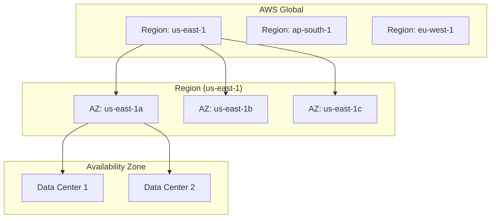

| Concept | Description |
|:--------|:------------|
| **Region** | Geographic area (e.g., Mumbai, N. Virginia) |
| **Availability Zone (AZ)** | Isolated data centers within a region |
| **Edge Location** | CDN endpoints for CloudFront |
| **Local Zone** | Extension of region for low-latency |

---

## 2. Compute Services

### Amazon EC2 (Elastic Compute Cloud)

**🎯 One-Liner**: "EC2 provides resizable virtual servers (instances) in the cloud with full control over OS, networking, and storage."

**📖 Elaboration**:

#### Instance Types

| Family | Use Case | Example |
|:-------|:---------|:--------|
| **t2/t3** | General purpose, burstable | Web servers, dev environments |
| **m5/m6i** | General purpose, balanced | App servers, databases |
| **c5/c6i** | Compute optimized | ML inference, batch processing |
| **r5/r6i** | Memory optimized | In-memory databases, caching |
| **p4/g5** | GPU instances | ML training, graphics |
| **i3/d2** | Storage optimized | Data warehousing, Hadoop |

#### Pricing Models

| Model | Description | Savings | Use Case |
|:------|:------------|:--------|:---------|
| **On-Demand** | Pay per hour/second | 0% | Short-term, unpredictable |
| **Reserved** | 1-3 year commitment | Up to 72% | Steady-state workloads |
| **Spot** | Bid on unused capacity | Up to 90% | Fault-tolerant, flexible |
| **Savings Plans** | Commit to $/hour | Up to 66% | Flexible across instance types |

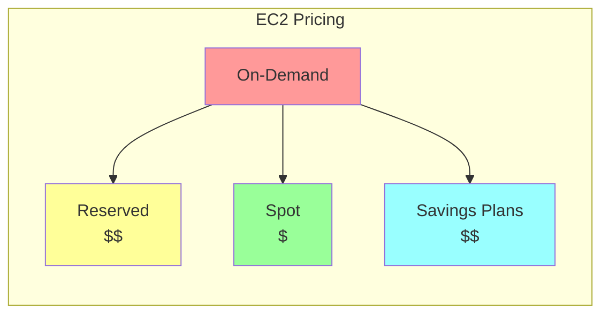

#### Key EC2 Concepts

| Concept | Description |
|:--------|:------------|
| **AMI** | Amazon Machine Image - template for instance |
| **Security Group** | Virtual firewall for inbound/outbound rules |
| **Key Pair** | SSH keys for secure access |
| **EBS** | Elastic Block Store - persistent storage |
| **Elastic IP** | Static public IP address |
| **User Data** | Bootstrap script run at launch |

### Auto Scaling

**🎯 One-Liner**: "Auto Scaling automatically adjusts the number of EC2 instances based on demand using scaling policies."

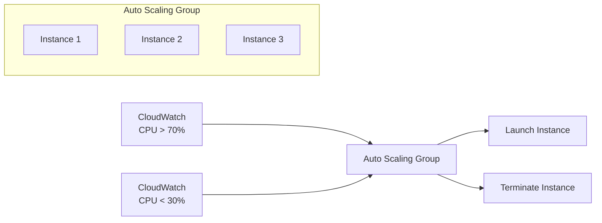

### Elastic Load Balancer (ELB)

**🎯 One-Liner**: "ELB distributes incoming traffic across multiple EC2 instances for high availability and fault tolerance."

| Type | Layer | Use Case |
|:-----|:------|:---------|
| **Application LB (ALB)** | Layer 7 (HTTP/HTTPS) | Web apps, path-based routing |
| **Network LB (NLB)** | Layer 4 (TCP/UDP) | High performance, static IP |
| **Gateway LB (GWLB)** | Layer 3 | Security appliances |
| **Classic LB** | Layer 4/7 | Legacy (deprecated) |

---

## 3. Storage Services

### Amazon S3 (Simple Storage Service)

**🎯 One-Liner**: "S3 is object storage with unlimited capacity, 99.999999999% (11 9s) durability, used for files, backups, and static hosting."

**📖 Elaboration**:

#### S3 Storage Classes

| Class | Durability | Availability | Use Case |
|:------|:-----------|:-------------|:---------|
| **Standard** | 11 9s | 99.99% | Frequently accessed data |
| **Intelligent-Tiering** | 11 9s | 99.9% | Unknown access patterns |
| **Standard-IA** | 11 9s | 99.9% | Infrequent access |
| **One Zone-IA** | 11 9s | 99.5% | Recreatable data |
| **Glacier Instant** | 11 9s | 99.9% | Archive, instant retrieval |
| **Glacier Flexible** | 11 9s | 99.99% | Archive, minutes-hours retrieval |
| **Glacier Deep Archive** | 11 9s | 99.99% | Long-term archive, 12-48 hours |

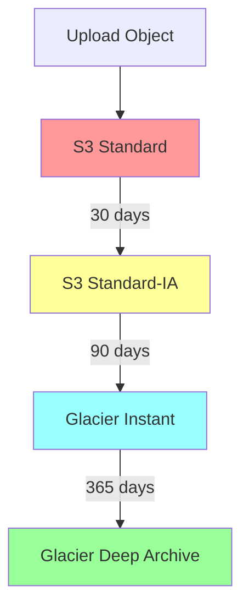

#### Key S3 Features

| Feature | Description |
|:--------|:------------|
| **Versioning** | Keep multiple versions of objects |
| **Lifecycle Rules** | Auto-transition between storage classes |
| **Bucket Policy** | JSON-based access control |
| **CORS** | Cross-origin resource sharing |
| **Transfer Acceleration** | Faster uploads via CloudFront |
| **Static Website Hosting** | Host static sites directly |
| **Encryption** | SSE-S3, SSE-KMS, SSE-C |

### Amazon EBS (Elastic Block Store)

**🎯 One-Liner**: "EBS provides persistent block storage volumes for EC2 instances, like a virtual hard drive."

| Volume Type | IOPS | Use Case |
|:------------|:-----|:---------|
| **gp3** | 3,000-16,000 | General purpose (default) |
| **io2** | Up to 256,000 | High-performance databases |
| **st1** | 500 | Throughput-optimized (big data) |
| **sc1** | 250 | Cold storage |

### Amazon EFS (Elastic File System)

**🎯 One-Liner**: "EFS is a managed NFS file system that can be mounted by multiple EC2 instances simultaneously."

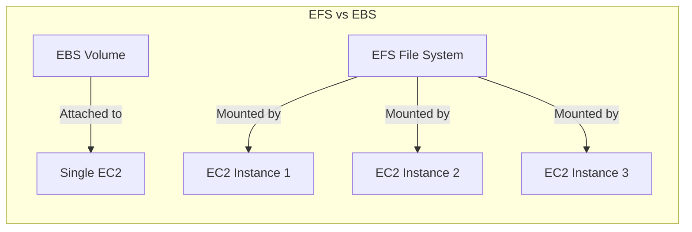

---

## 4. Database Services

### Database Options Overview

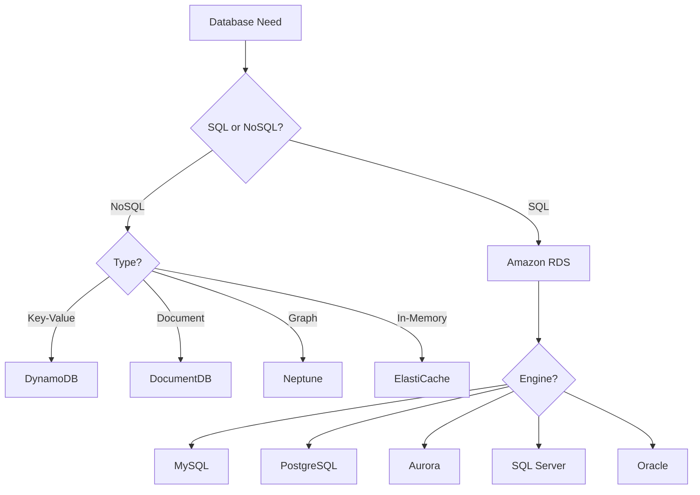

### Amazon RDS (Relational Database Service)

**🎯 One-Liner**: "RDS is a managed relational database supporting MySQL, PostgreSQL, Aurora, SQL Server, Oracle, and MariaDB."

**📖 Features**:
- Automated backups, patching, scaling
- Multi-AZ for high availability
- Read replicas for performance
- Encryption at rest and in transit

### Amazon Aurora

**🎯 One-Liner**: "Aurora is AWS's cloud-native MySQL/PostgreSQL compatible database with 5x performance and 3x lower cost."

| Feature | Aurora |
|:--------|:-------|
| **Performance** | 5x MySQL, 3x PostgreSQL |
| **Storage** | Auto-scales up to 128TB |
| **Replicas** | Up to 15 read replicas |
| **Failover** | < 30 seconds |
| **Serverless** | Aurora Serverless v2 available |

### Amazon DynamoDB

**🎯 One-Liner**: "DynamoDB is a fully managed NoSQL key-value database with single-digit millisecond latency at any scale."

**📖 Key Concepts**:

| Concept | Description |
|:--------|:------------|
| **Table** | Collection of items |
| **Item** | Single data record (like a row) |
| **Partition Key** | Primary key for distribution |
| **Sort Key** | Optional for range queries |
| **GSI** | Global Secondary Index |
| **LSI** | Local Secondary Index |
| **Capacity** | On-Demand or Provisioned |

```python
# DynamoDB Example with boto3
import boto3

dynamodb = boto3.resource('dynamodb')
table = dynamodb.Table('Users')

# Put item
table.put_item(Item={
    'user_id': '123',
    'name': 'Nihal',
    'email': 'nihal@example.com'
})

# Get item
response = table.get_item(Key={'user_id': '123'})
item = response['Item']
```

### Amazon ElastiCache

**🎯 One-Liner**: "ElastiCache is managed in-memory caching using Redis or Memcached for microsecond latency."

| Engine | Use Case |
|:-------|:---------|
| **Redis** | Complex data types, persistence, pub/sub |
| **Memcached** | Simple caching, multi-threaded |

---

## 5. Networking & CDN

### Amazon VPC (Virtual Private Cloud)

**🎯 One-Liner**: "VPC is your private isolated network in AWS where you control IP ranges, subnets, route tables, and gateways."

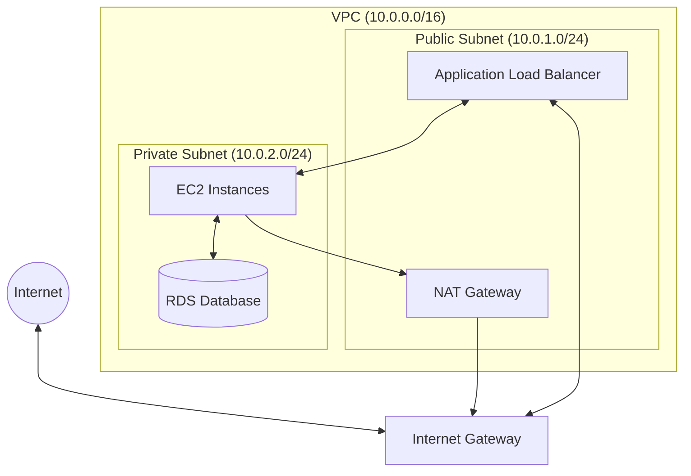

#### VPC Components

| Component | Description |
|:----------|:------------|
| **Subnet** | Range of IPs in VPC (public or private) |
| **Internet Gateway** | Connects VPC to internet |
| **NAT Gateway** | Allows private subnet outbound internet |
| **Route Table** | Rules for traffic routing |
| **Security Group** | Instance-level firewall (stateful) |
| **NACL** | Subnet-level firewall (stateless) |
| **VPC Peering** | Connect two VPCs |
| **VPN Gateway** | Connect VPC to on-premises |

### Security Group vs NACL

| Aspect | Security Group | NACL |
|:-------|:---------------|:-----|
| **Level** | Instance | Subnet |
| **State** | Stateful (auto allows response) | Stateless (explicit rules) |
| **Rules** | Allow only | Allow and Deny |
| **Evaluation** | All rules evaluated | Rules in order |
| **Default** | Deny all inbound | Allow all |

### Amazon CloudFront

**🎯 One-Liner**: "CloudFront is a CDN that caches content at 400+ edge locations worldwide for low latency delivery."

**📖 Use Cases**:
- Static website acceleration
- Video streaming
- API acceleration
- DDoS protection (with Shield)

### Route 53

**🎯 One-Liner**: "Route 53 is a managed DNS service with domain registration, health checks, and traffic routing policies."

| Routing Policy | Description |
|:---------------|:------------|
| **Simple** | Single resource |
| **Weighted** | Split traffic by percentage |
| **Latency** | Route to lowest latency region |
| **Failover** | Active-passive failover |
| **Geolocation** | Route based on user location |
| **Multi-value** | Return multiple healthy records |

---

## 6. Security & IAM

### IAM (Identity and Access Management)

**🎯 One-Liner**: "IAM controls who (authentication) can do what (authorization) on which AWS resources."

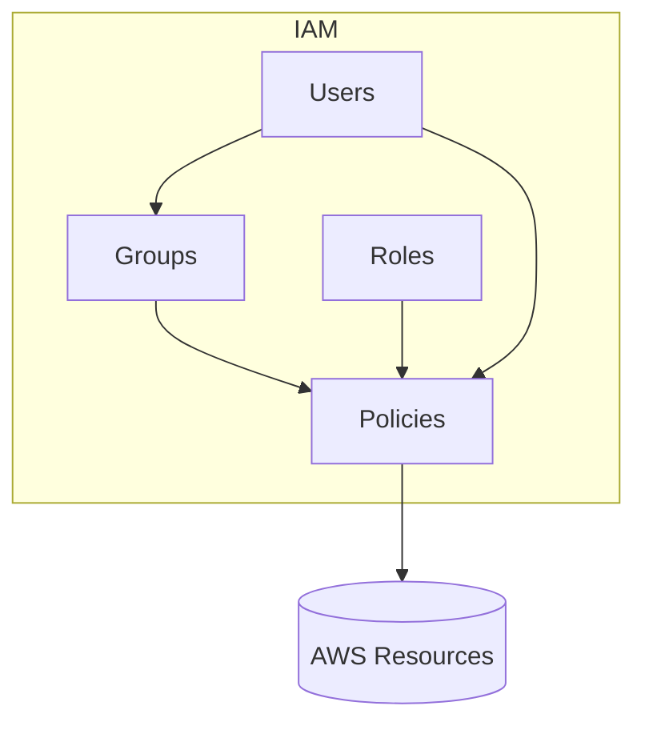

#### IAM Components

| Component | Description |
|:----------|:------------|
| **User** | Person or application |
| **Group** | Collection of users |
| **Role** | Temporary credentials for AWS services |
| **Policy** | JSON document defining permissions |
| **MFA** | Multi-factor authentication |

#### IAM Policy Example

```json
{
  "Version": "2012-10-17",
  "Statement": [
    {
      "Effect": "Allow",
      "Action": [
        "s3:GetObject",
        "s3:PutObject"
      ],
      "Resource": "arn:aws:s3:::my-bucket/*"
    },
    {
      "Effect": "Deny",
      "Action": "s3:DeleteObject",
      "Resource": "*"
    }
  ]
}
```

### Security Services

| Service | Purpose |
|:--------|:--------|
| **AWS KMS** | Key Management Service for encryption |
| **AWS Secrets Manager** | Rotate and manage secrets/API keys |
| **AWS Shield** | DDoS protection |
| **AWS WAF** | Web Application Firewall |
| **AWS GuardDuty** | Threat detection |
| **AWS Inspector** | Vulnerability scanning |
| **AWS Cognito** | User authentication (sign-up/login) |

### Best Practices

```
✅ Enable MFA for root and IAM users
✅ Use roles instead of long-term credentials
✅ Follow least privilege principle
✅ Use groups to assign permissions
✅ Rotate credentials regularly
✅ Never hardcode credentials in code
✅ Use AWS Secrets Manager or Parameter Store
✅ Enable CloudTrail for auditing
```

---

## 7. Serverless & Containers

### AWS Lambda

**🎯 One-Liner**: "Lambda runs code without managing servers; you pay only for compute time used (per 1ms)."

**📖 Elaboration**:

| Aspect | Details |
|:-------|:--------|
| **Languages** | Python, Node.js, Java, Go, .NET, Ruby |
| **Timeout** | Max 15 minutes |
| **Memory** | 128MB - 10GB |
| **Triggers** | API Gateway, S3, DynamoDB, SQS, EventBridge |
| **Pricing** | Per request + duration |

```python
# Lambda Function Example
import json

def lambda_handler(event, context):
    name = event.get('name', 'World')
    
    return {
        'statusCode': 200,
        'body': json.dumps(f'Hello, {name}!')
    }
```

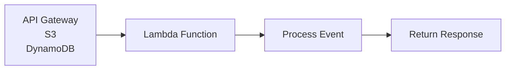

### API Gateway

**🎯 One-Liner**: "API Gateway creates, publishes, and manages REST, HTTP, and WebSocket APIs at any scale."

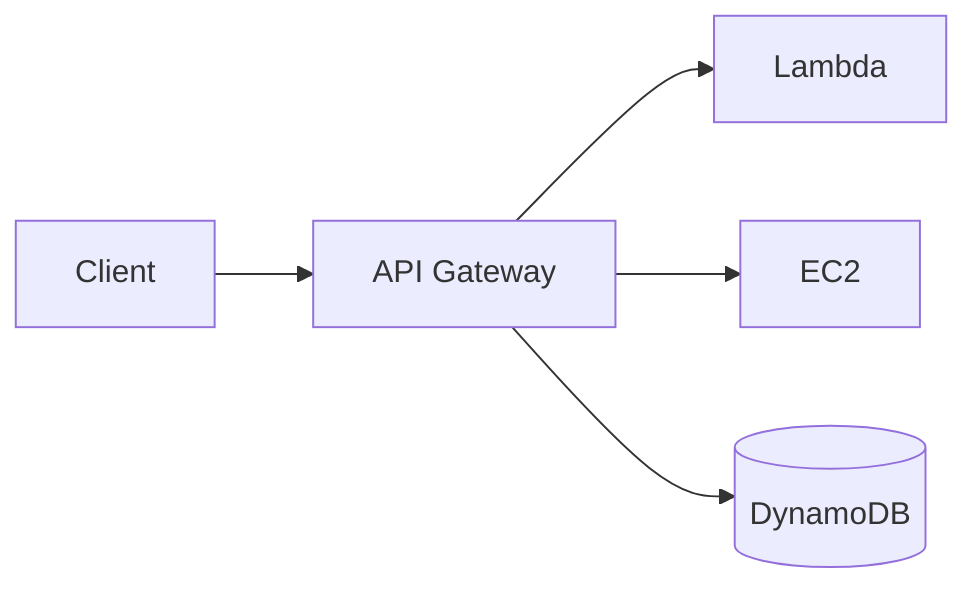

### Container Services

| Service | Description | Use Case |
|:--------|:------------|:---------|
| **ECS** | Elastic Container Service | Docker on AWS-managed |
| **EKS** | Elastic Kubernetes Service | Kubernetes on AWS |
| **Fargate** | Serverless containers | No EC2 management |
| **ECR** | Container Registry | Store Docker images |

### ECS vs EKS

**🎯 One-Liner**: "ECS is AWS-native container orchestration; EKS is managed Kubernetes for portability."

| Aspect | ECS | EKS |
|:-------|:----|:----|
| **Orchestration** | AWS proprietary | Kubernetes |
| **Complexity** | Simpler | Steeper learning curve |
| **Portability** | AWS-locked | Multi-cloud portable |
| **Ecosystem** | AWS tools | Kubernetes ecosystem |
| **Cost** | No cluster fee | $0.10/hour per cluster |

### Fargate

**🎯 One-Liner**: "Fargate is serverless compute for containers — no EC2 instances to manage."

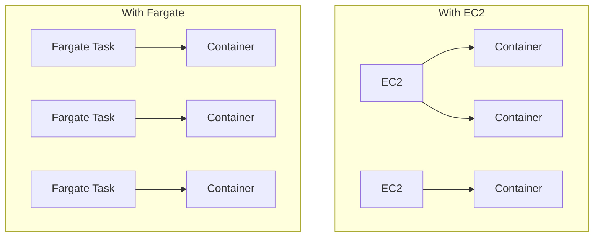

---

## 8. AI/ML Services

### AI/ML Services Overview

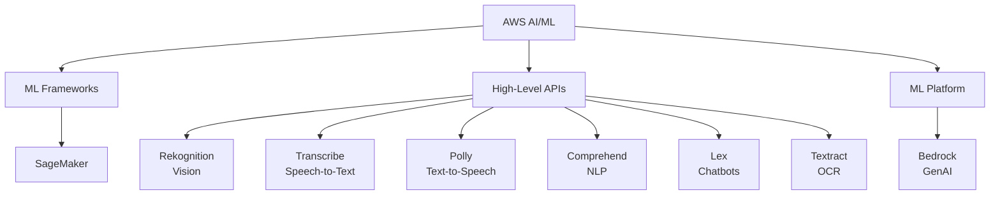

### Amazon SageMaker

**🎯 One-Liner**: "SageMaker is a fully managed platform to build, train, and deploy ML models at scale."

| Component | Purpose |
|:----------|:--------|
| **Studio** | IDE for ML development |
| **Notebooks** | Jupyter notebooks |
| **Training** | Distributed training |
| **Endpoints** | Model deployment |
| **Pipelines** | ML workflows |
| **Feature Store** | Feature management |
| **Model Registry** | Version control for models |

### Amazon Bedrock

**🎯 One-Liner**: "Bedrock provides access to foundation models (Claude, Llama, Titan) via a single API for GenAI applications."

```python
# Bedrock Example
import boto3
import json

bedrock = boto3.client('bedrock-runtime')

response = bedrock.invoke_model(
    modelId='anthropic.claude-3-sonnet-20240229-v1:0',
    body=json.dumps({
        "anthropic_version": "bedrock-2023-05-31",
        "messages": [{"role": "user", "content": "Explain AWS in one sentence"}],
        "max_tokens": 100
    })
)

result = json.loads(response['body'].read())
print(result['content'][0]['text'])
```

### AI Services Quick Reference

| Service | Function |
|:--------|:---------|
| **Rekognition** | Image/video analysis, face detection |
| **Textract** | OCR, document extraction |
| **Comprehend** | NLP, sentiment analysis |
| **Transcribe** | Speech to text |
| **Polly** | Text to speech |
| **Translate** | Neural machine translation |
| **Lex** | Conversational AI (chatbots) |
| **Kendra** | Intelligent search |

---

## 9. DevOps & Deployment

### CI/CD Services

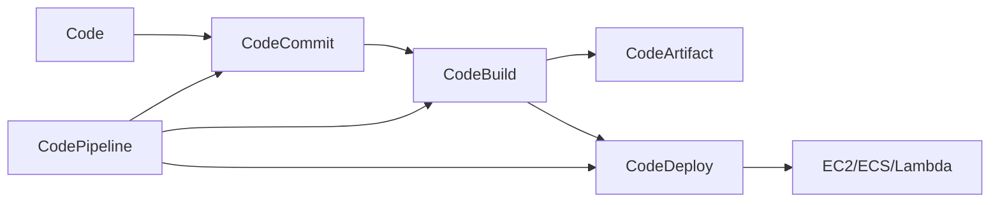

| Service | Purpose |
|:--------|:--------|
| **CodeCommit** | Git repository (like GitHub) |
| **CodeBuild** | Build & test (like Jenkins) |
| **CodeDeploy** | Deployment automation |
| **CodePipeline** | CI/CD orchestration |
| **CodeArtifact** | Package management |

### AWS CloudFormation

**🎯 One-Liner**: "CloudFormation is Infrastructure as Code (IaC) that provisions AWS resources using YAML/JSON templates."

```yaml
# CloudFormation Example
AWSTemplateFormatVersion: '2010-09-09'
Resources:
  MyBucket:
    Type: AWS::S3::Bucket
    Properties:
      BucketName: my-unique-bucket-name
      VersioningConfiguration:
        Status: Enabled

  MyEC2Instance:
    Type: AWS::EC2::Instance
    Properties:
      ImageId: ami-0123456789abcdef0
      InstanceType: t2.micro
```

### AWS CDK (Cloud Development Kit)

**🎯 One-Liner**: "CDK lets you define cloud infrastructure using familiar programming languages (Python, TypeScript, Java)."

```python
# CDK Example (Python)
from aws_cdk import App, Stack
from aws_cdk import aws_s3 as s3
from aws_cdk import aws_lambda as lambda_

class MyStack(Stack):
    def __init__(self, scope, id):
        super().__init__(scope, id)
        
        # Create S3 bucket
        bucket = s3.Bucket(self, "MyBucket",
            versioned=True
        )
        
        # Create Lambda
        fn = lambda_.Function(self, "MyFunction",
            runtime=lambda_.Runtime.PYTHON_3_9,
            handler="index.handler",
            code=lambda_.Code.from_asset("lambda")
        )

app = App()
MyStack(app, "MyStack")
app.synth()
```

### Monitoring & Logging

| Service | Purpose |
|:--------|:--------|
| **CloudWatch** | Metrics, logs, alarms, dashboards |
| **CloudTrail** | API activity logging (audit) |
| **X-Ray** | Distributed tracing |
| **AWS Config** | Resource configuration tracking |

---

## 10. Interview Q&A

---

### Q: What is AWS and why use it?

**🎯 One-Liner**: "AWS is the leading cloud platform offering scalable, reliable infrastructure with pay-as-you-go pricing and 200+ services."

---

### Q: Explain the difference between Region and Availability Zone?

**🎯 One-Liner**: "A Region is a geographic area (e.g., Mumbai); an Availability Zone is an isolated data center within a region for high availability."

---

### Q: What is EC2 and its pricing models?

**🎯 One-Liner**: "EC2 provides virtual servers. Pricing: On-Demand (pay per hour), Reserved (up to 72% off with commitment), Spot (up to 90% off for flexible workloads)."

---

### Q: Explain S3 storage classes.

**🎯 One-Liner**: "S3 offers Standard (frequent access), IA (infrequent), Glacier (archive), and Deep Archive (long-term), with cost decreasing as access frequency decreases."

---

### Q: What is VPC?

**🎯 One-Liner**: "VPC is an isolated virtual network where you control IP ranges, subnets, routing, and security using Security Groups and NACLs."

---

### Q: Security Group vs NACL?

**🎯 One-Liner**: "Security Group is stateful at instance level (allow only); NACL is stateless at subnet level (allow and deny)."

---

### Q: What is IAM Role vs IAM User?

**🎯 One-Liner**: "User is for people/apps with long-term credentials; Role provides temporary credentials for AWS services or cross-account access."

---

### Q: What is Lambda?

**🎯 One-Liner**: "Lambda is serverless compute that runs code in response to events, scaling automatically with per-millisecond billing."

---

### Q: ECS vs EKS?

**🎯 One-Liner**: "ECS is AWS-native container orchestration (simpler); EKS is managed Kubernetes (portable, larger ecosystem)."

---

### Q: What is CloudFormation?

**🎯 One-Liner**: "CloudFormation is Infrastructure as Code — define AWS resources in YAML/JSON templates for repeatable, version-controlled deployments."

---

### Q: How do you handle secrets in AWS?

**🎯 One-Liner**: "Use AWS Secrets Manager for automatic rotation, or Parameter Store for simple key-value secrets. Never hardcode in code."

---

### Q: What is Amazon Bedrock?

**🎯 One-Liner**: "Bedrock provides access to foundation models (Claude, Llama, Titan) via API for building GenAI applications without managing infrastructure."

---

## 11. Quick Revision Cheat Sheet

```
┌─────────────────────────────────────────────────────────────────┐
│                      AWS QUICK REFERENCE                         │
├─────────────────────────────────────────────────────────────────┤
│ COMPUTE                                                          │
│ EC2          → Virtual servers (instances)                      │
│ Lambda       → Serverless functions                             │
│ ECS/EKS      → Container orchestration                          │
│ Fargate      → Serverless containers                            │
├─────────────────────────────────────────────────────────────────┤
│ STORAGE                                                          │
│ S3           → Object storage (files, backups)                  │
│ EBS          → Block storage (EC2 disks)                        │
│ EFS          → Shared file system (NFS)                         │
│ Glacier      → Archive storage                                   │
├─────────────────────────────────────────────────────────────────┤
│ DATABASE                                                         │
│ RDS          → Managed SQL (MySQL, PostgreSQL)                  │
│ Aurora       → Cloud-native MySQL/PostgreSQL                    │
│ DynamoDB     → NoSQL key-value                                  │
│ ElastiCache  → In-memory (Redis, Memcached)                     │
├─────────────────────────────────────────────────────────────────┤
│ NETWORKING                                                       │
│ VPC          → Private network                                   │
│ Subnet       → IP range (public/private)                        │
│ Route 53     → DNS service                                       │
│ CloudFront   → CDN                                               │
│ ALB/NLB      → Load balancers                                   │
├─────────────────────────────────────────────────────────────────┤
│ SECURITY                                                         │
│ IAM          → Users, Roles, Policies                           │
│ Security Group → Instance firewall (stateful)                   │
│ NACL         → Subnet firewall (stateless)                      │
│ KMS          → Encryption keys                                   │
│ Secrets Manager → Manage secrets                                │
├─────────────────────────────────────────────────────────────────┤
│ AI/ML                                                            │
│ SageMaker    → ML platform                                       │
│ Bedrock      → GenAI/LLM APIs                                   │
│ Rekognition  → Image/video AI                                   │
│ Comprehend   → NLP                                               │
├─────────────────────────────────────────────────────────────────┤
│ DEVOPS                                                           │
│ CloudFormation → IaC (YAML/JSON)                                │
│ CDK          → IaC (Python/TS)                                  │
│ CodePipeline → CI/CD                                             │
│ CloudWatch   → Monitoring & Logs                                │
└─────────────────────────────────────────────────────────────────┘
```

### Service Selection Flowchart

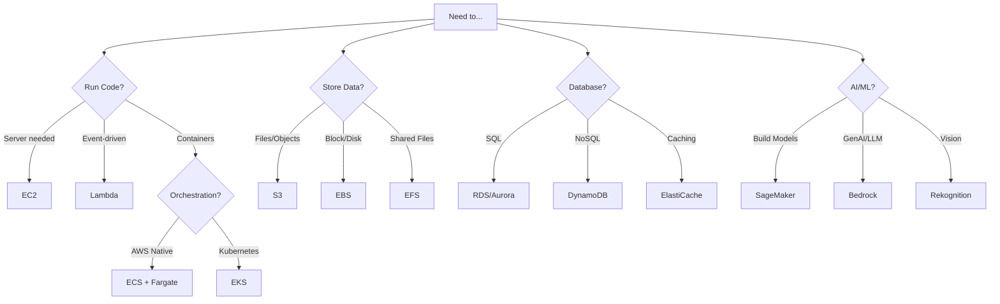

---

*Last Updated: February 8, 2026*

---

**Next doc:** [`complexity.md`](complexity.md)
