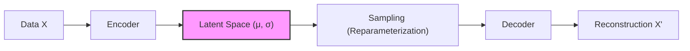
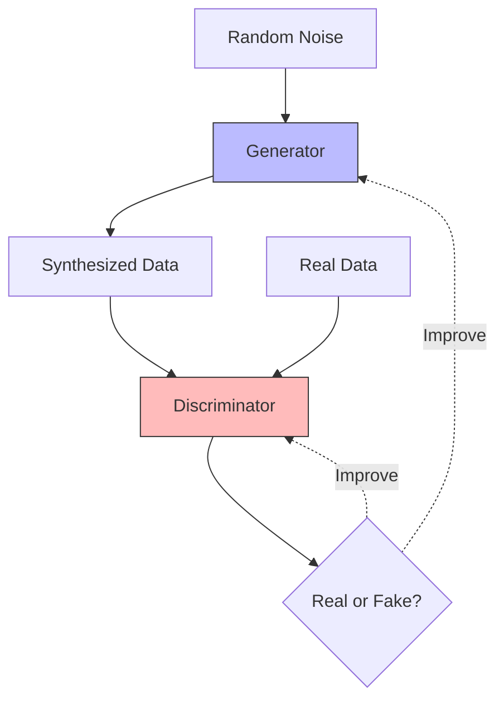
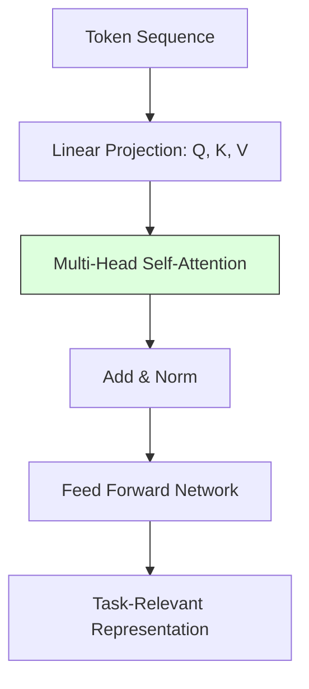
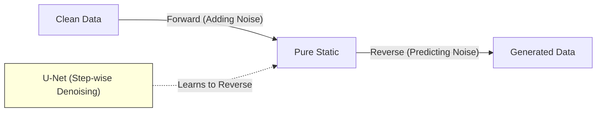
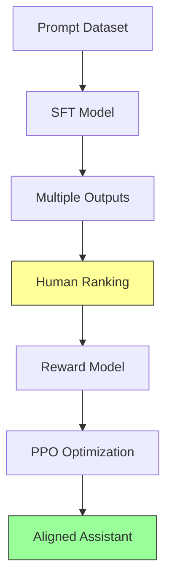

# Ten Foundational Milestones That Built Generative AI

## Introduction
Generative AI became practical through a sequence of breakthroughs, not one single invention. This guide explains ten foundational milestones from 2013 to 2022 for beginner-to-intermediate readers. Each milestone includes what changed, how it works in plain language, what results were reported, and why it still matters. The storyline starts with early deep generative methods (VAE and GAN), moves through sequence and attention architectures (Seq2Seq and Transformer), scales into general language models (BERT, GPT-2, GPT-3), expands to modern image generation and multimodality (DDPM, CLIP + DALL-E), and ends with alignment methods that made assistants usable (InstructGPT).

## At a Glance

| Milestone | Year | Core contribution | Why it mattered |
| --- | --- | --- | --- |
| 1. VAE | 2013/2014 | Variational latent-variable training with reparameterization | Made deep latent generative modeling trainable end-to-end |
| 2. GAN | 2014 | Adversarial generator-discriminator game | Produced much sharper synthetic samples |
| 3. Seq2Seq | 2014 | Encoder-decoder sequence transduction with LSTMs | Unified variable-length input/output tasks like translation |
| 4. Transformer | 2017 | Self-attention-first architecture | Enabled large-scale parallel training and modern LLMs |
| 5. BERT | 2018/2019 | Bidirectional masked-language pretraining | Standardized transfer learning for language understanding |
| 6. GPT-2 | 2019 | Large autoregressive LM with strong zero-shot behavior | Showed many tasks can be prompted as text continuation |
| 7. DDPM | 2020 | Iterative denoising diffusion generation | Restarted high-fidelity image generation with stable training |
| 8. CLIP + DALL-E | 2021 | Language-vision alignment plus text-to-image generation | Established language as the interface for visual generation |
| 9. GPT-3 | 2020 | 175B-parameter few-shot in-context learning | Validated scaling as a capability driver |
| 10. InstructGPT | 2022 | RLHF pipeline for instruction following | Turned raw LMs into useful assistant behavior |

## 1. Variational Autoencoders (VAE)

**Full title:** Auto-Encoding Variational Bayes  
**Authors:** Diederik P. Kingma, Max Welling  
**Year + venue status:** 2013 arXiv preprint; published in ICLR 2014-era proceedings  
**Primary source:** [arXiv:1312.6114](https://arxiv.org/abs/1312.6114)

**Core idea (1 sentence):** A VAE learns a smooth latent space for data and generates new samples by decoding random points from that space.

**How it works (plain language):**
A VAE has two networks: an encoder that maps an input (for example, an image) to a probability distribution in latent space, and a decoder that maps latent samples back to data. The reparameterization trick rewrites sampling so gradients can pass through stochastic steps during training. Think of it as learning a map where nearby coordinates correspond to similar outputs.

**Key result(s):**
It provided a practical recipe for training deep latent-variable generative models with standard backpropagation.

**Limitation(s):**
VAEs often trade sample sharpness for stability, which can lead to blurrier outputs than adversarial methods.

**Lasting impact:**
The encode-regularize-decode pattern became a core template for later generative and multimodal systems.

## 2. Generative Adversarial Networks (GAN)

**Full title:** Generative Adversarial Nets  
**Authors:** Ian J. Goodfellow et al.  
**Year + venue status:** 2014, NeurIPS 2014  
**Primary source:** [arXiv:1406.2661](https://arxiv.org/abs/1406.2661), [NeurIPS paper page](https://papers.nips.cc/paper/5423-generative-adversarial-nets)

**Core idea (1 sentence):** Train a generator and a discriminator in competition so the generator learns to produce realistic samples.

**How it works (plain language):**
The generator turns noise into candidate samples; the discriminator tries to distinguish real from generated data. Both improve against each other in a minimax game. Analogy: a forger improves because a detective keeps getting better.

**Key result(s):**
The paper established the adversarial objective and described the ideal equilibrium where the discriminator cannot do better than random guessing (0.5).

**Limitation(s):**
Training can be unstable, with issues like mode collapse and sensitivity to architecture/hyperparameters.

**Lasting impact:**
GANs pushed visual fidelity forward and defined adversarial training as a major paradigm in generative modeling.

## 3. Sequence to Sequence (Seq2Seq)

**Full title:** Sequence to Sequence Learning with Neural Networks  
**Authors:** Ilya Sutskever, Oriol Vinyals, Quoc V. Le  
**Year + venue status:** 2014, NeurIPS 2014  
**Primary source:** [arXiv:1409.3215](https://arxiv.org/abs/1409.3215), [NeurIPS paper page](https://papers.nips.cc/paper/5346-sequence-to-sequence-learning-with-neural-networks)

**Core idea (1 sentence):** An encoder RNN maps an input sequence to a representation that a decoder RNN transforms into an output sequence.

**How it works (plain language):**
The encoder reads the input sentence token by token and compresses information into its hidden state; the decoder then generates a target sentence token by token. The original paper also showed that reversing source word order improved optimization behavior.

**Key result(s):**
Reported strong neural machine translation performance, including 34.8 BLEU on WMT'14 English-to-French.

**Limitation(s):**
The fixed-size bottleneck struggles on long inputs, motivating attention mechanisms.

**Lasting impact:**
Seq2Seq became the standard framing for translation, summarization, and many text generation tasks.

## 4. Transformer

**Full title:** Attention Is All You Need  
**Authors:** Ashish Vaswani et al.  
**Year + venue status:** 2017, NeurIPS 2017  
**Primary source:** [arXiv:1706.03762](https://arxiv.org/abs/1706.03762), [NeurIPS paper page](https://proceedings.neurips.cc/paper/2017/hash/3f5ee243547dee91fbd053c1c4a845aa-Abstract.html)

**Core idea (1 sentence):** Replace recurrence with self-attention so each token can directly use information from all other tokens.

**How it works (plain language):**
Each token forms query, key, and value vectors; attention weights determine how much each token should read from others. Multi-head attention runs this process in parallel from different representation subspaces, while positional encoding preserves order.

**Key result(s):**
Reported state-of-the-art translation results, including 28.4 BLEU (English-German) and 41.8 BLEU (English-French), with improved training efficiency.

**Limitation(s):**
Full self-attention has quadratic cost in sequence length, creating long-context compute bottlenecks.

**Lasting impact:**
The Transformer became the default backbone for modern language, code, speech, and multimodal foundation models.

## 5. BERT

**Full title:** BERT: Pre-training of Deep Bidirectional Transformers for Language Understanding  
**Authors:** Jacob Devlin, Ming-Wei Chang, Kenton Lee, Kristina Toutanova  
**Year + venue status:** 2018 arXiv preprint; published at NAACL-HLT 2019  
**Primary source:** [arXiv:1810.04805](https://arxiv.org/abs/1810.04805), [ACL Anthology](https://aclanthology.org/N19-1423/)

**Core idea (1 sentence):** Pretrain an encoder with masked-token prediction so it learns bidirectional context, then fine-tune it for downstream tasks.

**How it works (plain language):**
BERT masks a subset of tokens and learns to recover them from both left and right context. After pretraining on large unlabeled corpora, small task-specific heads can be added and fine-tuned quickly.

**Key result(s):**
The paper reported state-of-the-art performance across major NLP benchmarks (including GLUE and SQuAD) and popularized the pretrain-then-fine-tune paradigm.

**Limitation(s):**
BERT is encoder-only, so it is not designed for free-form autoregressive text generation.

**Lasting impact:**
It made transfer learning standard in NLP and established pretrained Transformers as reusable infrastructure.

## 6. GPT-2

**Full title:** Language Models are Unsupervised Multitask Learners  
**Authors:** Alec Radford et al.  
**Year + venue status:** 2019 OpenAI technical report (not a peer-reviewed conference paper)  
**Primary source:** [OpenAI technical report page](https://openai.com/index/better-language-models/)

**Core idea (1 sentence):** A large next-token predictor trained on diverse web text can perform many tasks without task-specific training.

**How it works (plain language):**
GPT-2 uses a decoder-only Transformer trained to continue text. At inference, the prompt defines the task format (for example, translation or summarization), and the model continues accordingly.

**Key result(s):**
OpenAI reported a 1.5B-parameter model trained on about 40 GB of text from roughly 8 million web pages, with strong zero-shot behavior on multiple tasks.

**Limitation(s):**
Outputs can be fluent but wrong, and reliability varies strongly with prompt phrasing.

**Lasting impact:**
It strengthened the idea that many NLP tasks can be expressed as prompting plus continuation.

## 7. Denoising Diffusion Probabilistic Models (DDPM)

**Full title:** Denoising Diffusion Probabilistic Models  
**Authors:** Jonathan Ho, Ajay Jain, Pieter Abbeel  
**Year + venue status:** 2020, NeurIPS 2020  
**Primary source:** [arXiv:2006.11239](https://arxiv.org/abs/2006.11239), [NeurIPS paper page](https://proceedings.neurips.cc/paper/2020/hash/4c5bcfec8584af0d967f1ab10179ca4b-Abstract.html)

**Core idea (1 sentence):** Learn to generate data by reversing a gradual noising process, step by step.

**How it works (plain language):**
Training corrupts data with increasing Gaussian noise and teaches a network to predict and remove that noise at each timestep. Generation starts from random noise and repeatedly denoises to a coherent sample.

**Key result(s):**
Reported competitive image quality, including FID 3.17 on CIFAR-10.

**Limitation(s):**
Sampling is iterative and slower than one-pass generators.

**Lasting impact:**
DDPM started the diffusion wave that now underpins many state-of-the-art image generation systems.

## 8. CLIP + DALL-E (Combined Multimodal Milestone)

**Full title:**
- Learning Transferable Visual Models From Natural Language Supervision (CLIP)
- Zero-Shot Text-to-Image Generation (DALL-E)

**Authors:**
- CLIP: Alec Radford et al.
- DALL-E: Aditya Ramesh et al.

**Year + venue status:** 2021, both published in ICML 2021 proceedings  
**Primary source:** [CLIP (PMLR)](https://proceedings.mlr.press/v139/radford21a.html), [DALL-E (PMLR)](https://proceedings.mlr.press/v139/ramesh21a.html), [OpenAI DALL-E page](https://openai.com/index/dall-e/)

**Core idea (1 sentence):** CLIP aligns text and images in a shared embedding space, while DALL-E generates images from text using autoregressive token modeling.

**How it works (plain language):**
CLIP trains image and text encoders together so matched pairs are close in vector space and mismatches are far apart. DALL-E tokenizes images and text, then autoregressively predicts image tokens conditioned on the text prompt.

**Key result(s):**
CLIP was trained on 400 million image-text pairs. DALL-E used a 12-billion-parameter Transformer for zero-shot text-to-image generation.

**Limitation(s):**
Early systems struggled with compositional reasoning, detailed spatial relations, and high-resolution realism compared with newer diffusion models.

**Lasting impact:**
This milestone established natural language as a practical control interface for visual generation and retrieval.

## 9. GPT-3

**Full title:** Language Models are Few-Shot Learners  
**Authors:** Tom B. Brown et al.  
**Year + venue status:** 2020, NeurIPS 2020  
**Primary source:** [arXiv:2005.14165](https://arxiv.org/abs/2005.14165), [NeurIPS paper page](https://proceedings.neurips.cc/paper/2020/hash/1457c0d6bfcb4967418bfb8ac142f64a-Abstract.html)

**Core idea (1 sentence):** Scaling a decoder-only Transformer to 175B parameters unlocks strong in-context few-shot learning.

**How it works (plain language):**
Instead of updating model weights for every task, GPT-3 can infer a task format from examples placed directly in the prompt. This shifts adaptation from gradient updates to prompt design.

**Key result(s):**
The paper introduced the 175B-parameter GPT-3 model and demonstrated broad zero-shot, one-shot, and few-shot improvements across language benchmarks.

**Limitation(s):**
It still hallucinates, inherits web-scale biases, and lacks guaranteed factual grounding.

**Lasting impact:**
GPT-3 validated scaling as a central capability lever and accelerated API-first foundation-model products.

## 10. InstructGPT

**Full title:** Training language models to follow instructions with human feedback  
**Authors:** Long Ouyang et al.  
**Year + venue status:** 2022, NeurIPS 2022  
**Primary source:** [arXiv:2203.02155](https://arxiv.org/abs/2203.02155), [NeurIPS paper page](https://proceedings.neurips.cc/paper_files/paper/2022/hash/b1efde53be364a73914f58805a001731-Abstract-Conference.html)

**Core idea (1 sentence):** Align model behavior to user intent by combining supervised instruction tuning, reward modeling, and reinforcement learning from human feedback (RLHF).

**How it works (plain language):**
The pipeline has three stages: supervised fine-tuning on human-written responses, reward-model training on ranked outputs, and policy optimization (PPO) against that learned reward. In effect, the model is trained not only to predict text, but to prefer what humans rate as more helpful.

**Key result(s):**
Human raters preferred outputs from a 1.3B InstructGPT model over outputs from the 175B GPT-3 baseline in the study setup.

**Limitation(s):**
Preference data is subjective and can miss diverse user values; reward hacking and over-optimization remain practical risks.

**Lasting impact:**
It defined the alignment training recipe that shaped modern AI assistants.

## How the Milestones Connect

The lineage starts with two competing ways to generate data: VAE (explicit latent-variable modeling) and GAN (adversarial realism). Seq2Seq then framed sequence transformation as a general neural mapping problem but exposed bottlenecks on long contexts.

The Transformer removed recurrence and became the shared substrate for two dominant language paths: encoder-centric understanding (BERT) and decoder-centric generation (GPT family). GPT-2 and GPT-3 showed that scale and prompting can convert a single model into a broad task engine.

In vision and multimodality, DDPM shifted high-fidelity image generation toward diffusion, while CLIP + DALL-E connected language and images through shared representations and text-conditioned synthesis.

InstructGPT closes the loop from capability to usability: strong base models became materially more helpful once optimized against human preference signals.

## References (Primary Sources)

1. Kingma, Welling. Auto-Encoding Variational Bayes. [https://arxiv.org/abs/1312.6114](https://arxiv.org/abs/1312.6114)
2. Goodfellow et al. Generative Adversarial Nets. [https://arxiv.org/abs/1406.2661](https://arxiv.org/abs/1406.2661)
3. Sutskever, Vinyals, Le. Sequence to Sequence Learning with Neural Networks. [https://arxiv.org/abs/1409.3215](https://arxiv.org/abs/1409.3215)
4. Vaswani et al. Attention Is All You Need. [https://arxiv.org/abs/1706.03762](https://arxiv.org/abs/1706.03762)
5. Devlin et al. BERT. [https://arxiv.org/abs/1810.04805](https://arxiv.org/abs/1810.04805)
6. Radford et al. GPT-2 technical report page. [https://openai.com/index/better-language-models/](https://openai.com/index/better-language-models/)
7. Ho, Jain, Abbeel. DDPM. [https://arxiv.org/abs/2006.11239](https://arxiv.org/abs/2006.11239)
8. Radford et al. CLIP. [https://arxiv.org/abs/2103.00020](https://arxiv.org/abs/2103.00020)
9. Ramesh et al. DALL-E. [https://arxiv.org/abs/2102.12092](https://arxiv.org/abs/2102.12092)
10. Brown et al. GPT-3. [https://arxiv.org/abs/2005.14165](https://arxiv.org/abs/2005.14165)
11. Ouyang et al. InstructGPT. [https://arxiv.org/abs/2203.02155](https://arxiv.org/abs/2203.02155)
