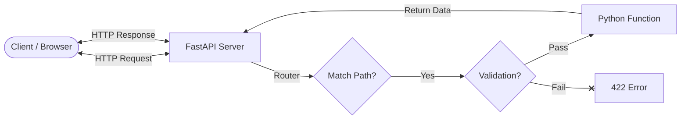
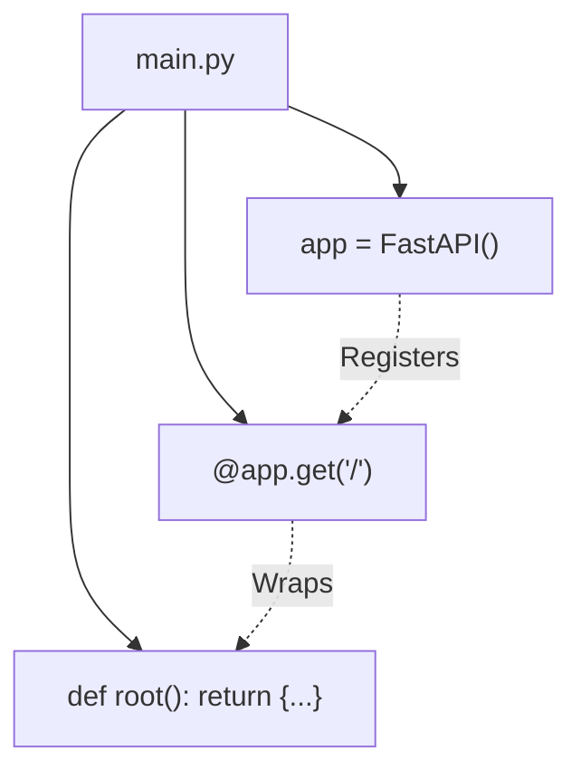
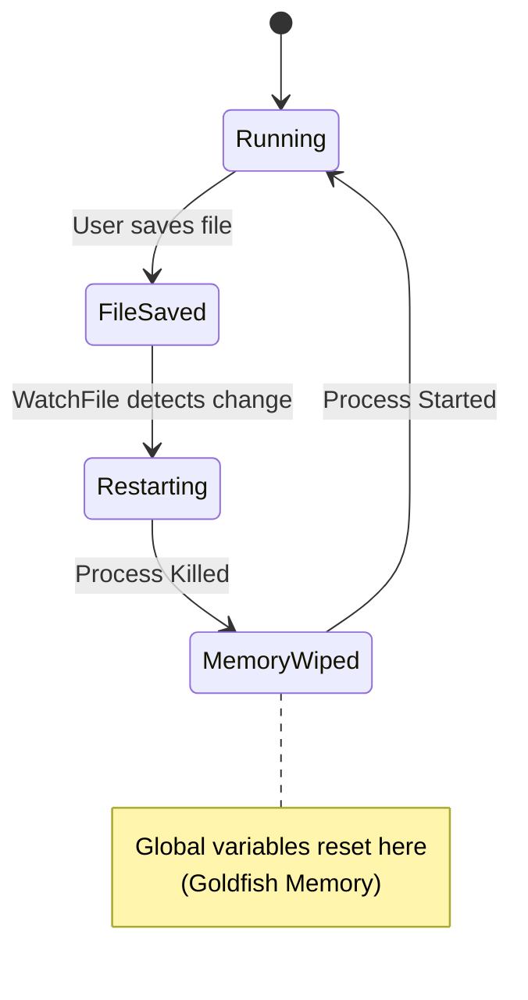
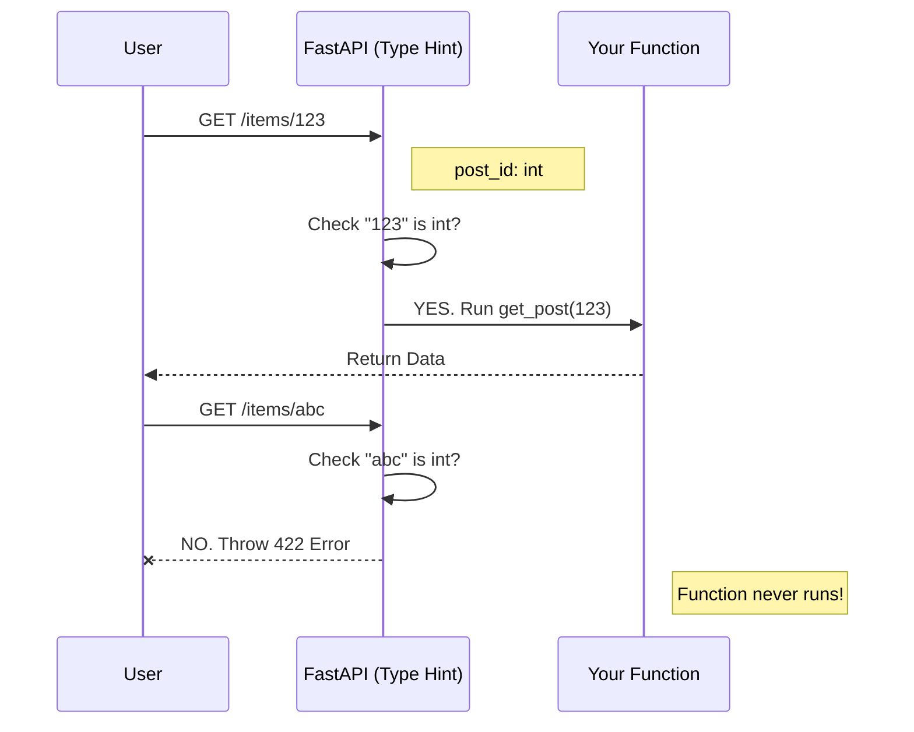

# FastAPI Technical Notes: From First Principles

## 1. Core Primitives & Theory
FastAPI is built on a few fundamental concepts:
- HTTP: The protocol where clients send requests (Method + Path + Headers + Body) and servers send responses (Status Code + Headers + Body).
- JSON: The standard "wire format" for API data.
- Python Functions: You write standard Python logic; FastAPI calls these functions when a request matches a specific route.
- Type Hints: Python annotations (e.g., id: int) that act as a "bouncer," validating data before it ever reaches your code.



## 2. Setup & Environment
### The "Golden Path" for Installation
1. Virtual Environment (Mandatory): Isolate your project dependencies.
```bash
# macOS/Linux
python -m venv .venv
source .venv/bin/activate
# Windows
python -m venv .venv
.venv\Scripts\activate
```
2. Installation:
```bash
pip install "fastapi[standard]"
```
Note: [standard] includes uvicorn (the server) and fastapi CLI tools.

### VS Code Configuration
Interpreter Selection: Ensure VS Code is using the Python inside your .venv, not the global or Conda Python.  
Command: Cmd+Shift+P -> Python: Select Interpreter -> Select .venv/bin/python.  
Terminal: If your terminal shows (base), run `conda config --set auto_activate_base false` to stop Conda from hijacking your shell.

## 3. Basic Application Structure (main.py)
The minimal viable application:
```python
from fastapi import FastAPI
# 1. Create the App Instance
app = FastAPI()
# 2. Define a Route (Decorator)
@app.get("/")
def root():
    # 3. Return Python Data (Dict/List)
    return {"message": "Hello World"}
```



### Running the App
Development Mode: `fastapi dev main.py`  
Behavior: Auto-reloads on file save.  
Consequence: "Goldfish Memory" -- Global variables (in-memory lists/counters) reset every time you save.



Production Mode: `fastapi run main.py`  
Behavior: Stable, no auto-reload.

## 4. Building Endpoints (The "Build-Up")
### A. Routing & State
Routing: Mapping (HTTP Method, URL Path) -> Python Function.  
State: You can use global lists as simple in-memory databases, but remember they wipe on restart.
```python
posts = [{"id": 1, "title": "First Post"}]
@app.get("/api/posts")
def get_posts():
    return posts  # FastAPI automatically serializes this list to JSON
```

### B. Path Parameters & Validation
Using type hints to extract and validate URL segments.
```python
from fastapi import HTTPException
@app.get("/api/posts/{post_id}")
def get_post(post_id: int):  # Type hint 'int' validates input automatically
    # Logic to find post
    for post in posts:
        if post["id"] == post_id:
            return post
    # Standard HTTP 404 for "Not Found"
    raise HTTPException(status_code=404, detail="Post not found")
```
The "Bouncer" Effect: If a user visits `/api/posts/abc`, FastAPI blocks the request before your function runs because `abc` is not an `int`.



## 5. Advanced Configuration
### Returning HTML (Changing Media Type)
By default, FastAPI returns JSON. You can override this to serve web pages.
```python
from fastapi.responses import HTMLResponse
@app.get("/", response_class=HTMLResponse)
def home():
    return "<h1>Hello World</h1>"
```

### Hiding Utility Endpoints
You can hide internal endpoints (like health checks or landing pages) from the generated API documentation.
```python
@app.get("/health", include_in_schema=False)
def health_check():
    return {"status": "ok"}
```

## 6. My Doubts & Q&A Log
Specific questions raised during the learning session:

Q1: Why does my terminal say (base) and how do I get rid of it?  
The Doubt: I don't want Conda hijacking my terminal; I want to use my venv.  
The Solution: Run `conda config --set auto_activate_base false` once. Close and reopen the terminal.  
Why: Conda runs a "hook" that auto-activates its base environment on startup. Disabling this lets you manage environments manually using `source .venv/bin/activate`.

Q2: What is the difference between fastapi dev and fastapi run?  
The Doubt: They both start the server, so what's the difference?  
The Answer:  
dev (Development): Has "Goldfish Memory." It watches your files. When you save, it kills the server and restarts it immediately so your changes apply.  
run (Production): Stable. It does not reload on save. It is meant for when the code is finished.

Q3: Why "localhost:8000"?  
The Doubt: What do these numbers actually mean?  
The Answer:  
localhost (127.0.0.1): The "Boomerang." It means "this computer." The request leaves your browser and immediately loops back to your own machine.  
8000: The "Door Number" (Port). Web servers need a port to listen on. 80 and 443 are privileged (standard web), so dev tools use high numbers like 8000 to avoid conflicts.

Q4: What if I don't want JSON? (HTML Request)  
The Doubt: Can I serve a normal web page?  
The Answer: Yes, use `response_class=HTMLResponse`. This changes the Content-Type header from `application/json` to `text/html`, telling the browser to render the string as a website.

## 7. Key "Wow" Moments & Memory Hooks
| Concept | Memory Hook | Meaning |
| --- | --- | --- |
| Type Hints | The Bouncer | They gatekeep data. Bad data gets rejected automatically. |
| Docs | Free Contract | Write code once; get Swagger UI (/docs) for free. |
| Localhost | The Boomerang | 127.0.0.1 means the request leaves the browser and hits your own machine immediately. |
| 404 Error | Missing Book | The "Librarian" (Server) cannot find the resource you asked for. |
| Dev Mode | Reincarnation | Every time you save, the server dies and is reborn (resetting memory). |

## 8. Quick Cheat Sheet
| Action | Command / Code |
| --- | --- |
| Install | `pip install "fastapi[standard]"` |
| Import | `from fastapi import FastAPI` |
| Init App | `app = FastAPI()` |
| Define GET | `@app.get("/path")` |
| Path Variable | `@app.get("/users/{user_id}")` |
| Type Validation | `def read_user(user_id: int):` |
| Run (Dev) | `fastapi dev main.py` (Auto-reload) |
| Run (Prod) | `fastapi run main.py` (No reload) |
| View Docs | Open browser to http://127.0.0.1:8000/docs |
| 404 Error | `raise HTTPException(status_code=404, detail="...")` |

## 9. Technical Interview Q&A (From Learned Material)
Q1: How does FastAPI handle data validation for path parameters? A: FastAPI uses standard Python type hints. If a function argument is typed as id: int, FastAPI will attempt to parse the URL segment as an integer. If parsing fails (e.g., the user sends "abc"), FastAPI automatically returns a validation error response before the function runs.

Q2: What happens to in-memory variables (like a global list) when running in fastapi dev mode? A: They are reset every time the code is saved. This is because fastapi dev triggers a process restart (auto-reload) to apply code changes, clearing the memory state.

Q3: Explain the semantic difference between fastapi dev and fastapi run. A: fastapi dev is optimized for development with auto-reloading enabled (changes apply instantly). fastapi run is optimized for production; it does not auto-reload and is meant for stable execution.

Q4: By default, what format does FastAPI serialize return values into? How do you change this? A: It serializes data into JSON (Content-Type: application/json). To change this (e.g., to HTML), you must explicitly set the response_class parameter in the route decorator (e.g., response_class=HTMLResponse).

Q5: What is the purpose of include_in_schema=False? A: It keeps an endpoint functional but hides it from the auto-generated OpenAPI documentation (Swagger UI). This is useful for internal tools, health checks, or landing pages that shouldn't clutter the public API docs.

Q6: What does it mean when we say localhost is a "loopback"? A: It means the network request does not leave the computer. The signal is sent from the client (browser) and immediately loops back to the server running on the same machine.
